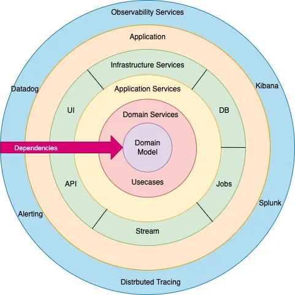
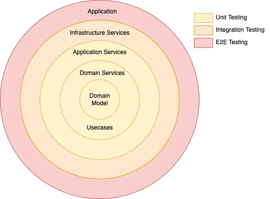

# Purpose

This repository is a crash course on how to develop container-native
applications.

## Disclaimers

While this is intended to educate developers on development workflows for
container-native applications, much of the implementation is opinionated, and
not a golden standard of how to do things. However, wherever possible, I attempt
to provide context, existing standards or patterns, and other such references
to provide understanding for why a decision is being made.

For example, the quality of the code (software design patterns, glue code, etc.)
comes secondary to the experience that is intended to be gained here.

## Prerequisites

- [Docker Desktop](https://www.docker.com/products/docker-desktop/) or [Docker Engine for Linux](https://docs.docker.com/engine/install/ubuntu/)

  > Note: if you're on Docker v1 in Linux, you need to install
  > [Docker Compose](https://docs.docker.com/compose/install/linux/) separately.

- [KinD (Kubernetes-in-Docker)](https://kind.sigs.k8s.io/docs/user/quick-start/#installation)

  If you are using KinD, it is recommended to use it [with an image registry]().
  [I have a repository here](https://github.com/codihuston/kind-with-registry)
  that I use for deploying different versions of Kubernetes with an image
  registry. Currently, these scripts are designed to run one cluster and
  registry at a time. If you need to run multiple clusters and multiple
  registries, you will need to update the port mapping of the image registry
  for each instance. We will only use one instance for this lab.

- [Kubectl](https://kubernetes.io/docs/tasks/tools/)

  > Note: it is recommended that your `kubectl` client matches your Kubernetes
  > server major version, but this is not a strict requirement.

- [Delve](https://github.com/go-delve/delve)

  While we will be developing a go application within a container that
  contains all of the appropriate tooling, you will want to consider
  installing [Go](https://go.dev/dl/).

## Table of Contents

- [Purpose](#purpose)
  - [Disclaimers](#disclaimers)
  - [Prerequisites](#prerequisites)
  - [Table of Contents](#table-of-contents)
  - [How to Use](#how-to-use)
  - [Topics](#topics)
  - [The Demo Application](#the-demo-application)
- [Docker](#docker)
  - [How to Run a Docker Container](#how-to-run-a-docker-container)
  - [How to Build Your Own Docker Container](#how-to-build-your-own-docker-container)
  - [Volume Mounts](#volume-mounts)
  - [Environment Variables and Executing Commands Within the Container](#environment-variables-and-executing-commands-within-the-container)
  - [Docker Networking (and DNS resolution)](#docker-networking-and-dns-resolution)
- [Docker Compose](#docker-compose)
  - [Prerequisites](#prerequisites-1)
  - [Initializing the API Application](#initializing-the-api-application)
  - [Dockerizing the API](#dockerizing-the-api)
  - [Adding the Database Layer](#adding-the-database-layer)
  - [Fix Broken Imports in VSCode](#fix-broken-imports-in-vscode)
  - [Adding CRUD Features to API](#adding-crud-features-to-api)
    - [Create a Blog Record](#create-a-blog-record)
    - [Get All Blogs](#get-all-blogs)
    - [Get a Single Blog](#get-a-single-blog)
    - [Update a Blog](#update-a-blog)
    - [Delete a Blog](#delete-a-blog)
  - [Setup the Go Debugger](#setup-the-go-debugger)
    - [Running Tests](#running-tests)
  - [Testing I](#testing-i)
    - [A Handful of Unit Tests](#a-handful-of-unit-tests)
    - [Unit Testing, Integration Testing, and Stubs I](#unit-testing-integration-testing-and-stubs-i)
    - [Unit Testing, Integration Testing, and Stubs II](#unit-testing-integration-testing-and-stubs-ii)
- [A Major Refactor - Business and Software Architecture](#a-major-refactor---business-and-software-architecture)
  - [Enterprise Architecture](#enterprise-architecture)
  - [Onion Architecture](#onion-architecture)
  - [SOLID Principals](#solid-principals)
  - [The Refactor](#the-refactor)
    - [Initializes an `Inversion of Control` container (`IoC`)](#initializes-an-inversion-of-control-container-ioc)
    - [The database connection (no changes needed)](#the-database-connection-no-changes-needed)
    - [Error Handling Middleware](#error-handling-middleware)
    - [Controllers, Services, Repositories, and Testing](#controllers-services-repositories-and-testing)
    - [Key Takeaways](#key-takeaways)
- [Kubernetes: An Introduction](#kubernetes-an-introduction)
  - [The Problem With Scale](#the-problem-with-scale)
    - [With Docker](#with-docker)
    - [Docker Compose](#docker-compose-1)
    - [Introducing Kubernetes](#introducing-kubernetes)
  - [Developing for Kubernetes](#developing-for-kubernetes)
  - [Kubernetes Architecture and Components](#kubernetes-architecture-and-components)
    - [Control Plane Nodes](#control-plane-nodes)
    - [Worker Nodes](#worker-nodes)
  - [Kubernetes Primitives that Developers Care About](#kubernetes-primitives-that-developers-care-about)
    - [Namespace](#namespace)
    - [Service](#service)
    - [Service Account](#service-account)
    - [Role](#role)
    - [RoleBinding](#rolebinding)
    - [Deployments and Pods](#deployments-and-pods)
      - [Init Containers](#init-containers)
      - [Volumes](#volumes)
      - [The Downward API](#the-downward-api)
    - [ConfigMaps](#configmaps)
  - [Secrets](#secrets)
  - [Talking to the API Server: Kubectl](#talking-to-the-api-server-kubectl)
  - [Debugging Kubernetes Resources](#debugging-kubernetes-resources)
- [Deploying to Kubernetes](#deploying-to-kubernetes)
  - [Prerequisites](#prerequisites-2)
  - [Example CI Workflow](#example-ci-workflow)
  - [Building Our API Docker Image](#building-our-api-docker-image)
  - [Pushing our API Docker Image](#pushing-our-api-docker-image)
    - [Run the Compose Environment](#run-the-compose-environment)
      - [Cleanup](#cleanup)
    - [Run the Kubernetes Environment](#run-the-kubernetes-environment)
      - [Testing the Kubernetes Deployment](#testing-the-kubernetes-deployment)
      - [Debugging the Kubernetes Deployment](#debugging-the-kubernetes-deployment)
      - [Cleanup](#cleanup-1)
  - [Analysis of Deployment Environments](#analysis-of-deployment-environments)
- [What's Next?](#whats-next)
    - [Other Points of Interest](#other-points-of-interest)
  - [Kubernetes Operator Development](#kubernetes-operator-development)
    - [Resources on Operator Development](#resources-on-operator-development)
    - [High Level Complexities of an Operator](#high-level-complexities-of-an-operator)

## How to Use

This repository is provided as-is. It is recommened that you follow the
instructions below and execute them yourself in an empty directory, and use
this repository as a completed example.

> Pro tip: step through and review each commit in the git history.

## Topics

1. [Docker](#docker)
2. [Docker Compose](#docker-compose)
   1. Composing a microservice application
   2. Writing tests in Go
   3. Using the golang debugger
3. Kubernetes

   > Note: We'll cover these topics from the perspective of a developer who
   > simply wants to deploy their application in Kubernetes. Later, we'll
   > add more context that covers some more advanced topics.

   1. Primitives
      1. Pod
      2. Deployment
         1. Downward API
      3. ConfigMap
      4. Secrets
      5. Services
         1. Port Forwarding with Kubectl
   2. Architecture
      1. KubeAPI
      2. 
   3. Identity
      1. Service
      2. ServiceAccount
   4. Advanced Topics
      1. Volume Mounts - Sharing volumes between containers
      2. [Ingress](https://kind.sigs.k8s.io/docs/user/ingress/#ingress-nginx)

         Cover things like TLS termination, Sticky Sessions via annotations.

4. Kubernetes Operators
   
   This will be covered in a separate effort, but you can [start here](https://sdk.operatorframework.io/docs/building-operators/golang/tutorial/).

## The Demo Application

We will build a simple blog application. It will consist of the following
services and components:

1. REST API to CRUD a blog post
2. PostgreSQL back-end
3. Redis as a caching layer

The application will offer a **very insecure** method of authentication and
authorization for the purpose of demonstrating Ingress.

Again, the focus here is to demonstrate ways to be efficient in the developer
workflow for writing features.

# Docker

In this section, we'll experiment briefly with the most common features of
Docker. We will complete this section using the [nginx](https://hub.docker.com/_/nginx)
web server.

Containerization is a feature of the Linux Kernel. It enables the container
host to maintain an abstraction layer between the host and other containers, as
if the containers were run independently, agnostic of its host and other
containers. Containers can be networked together, so they can communicate to
each other.

> Note: these "wins" I'm listing aren't really in any particular order, they
> are just coming to mind as I type this...

The biggest win of containers is it does not require an entire hypervisor
like Virtual Machines do. This means that the virtualization is done at the
Host OS level, as opposed to the Hardware level (Type 1 Hypervisor) or the
Hypervisor on the Host OS level (Type 2). This is overall vastly more efficient
of compute resources.

The second biggest win is Docker Containers enable us to
"package software together" into an [OCI-compliant container](https://opencontainers.org/).
If you've ever configured a web server with PHP, PERL, or anything like that,
you know that it's a pain in the ass, and kind of a mystery. The advent
of [ansible](https://www.ansible.com/) and [chef](https://docs.chef.io/)
alleviated some of that overhead, but still requried overhead of its own.

However, a docker container image configured with PHP can be done once, and
distributed to anyone for use immediately with a container engine like Docker.
Apply this logic to any complex software, and boom, you can string together any
number of services far easier than ever before. For example, no more
[XAMPP](https://www.apachefriends.org/) or installing databases or web servers
directly onto your computer. You can deploy and throw away containers at will!

The third biggest win is precisely that, the disposability of running
containers. It makes it easy for you to deploy specific versions of a product,
like say `mysql` at will. All you have to do is change the `tag` of the docker
image and you can test your own product against a different version of `mysql`
with almost zero effort, allowing you discover gaps in your product sooner!
No more installing multiple versions of a database on your host, or on a
shared developer server!

The fourth biggest win is `developer experience`
(really, the biggest win for probably every *developer*)! If it works on my
machine, it will 99% work on your machine, and vastly faster than something
like [vagrant](https://www.vagrantup.com/). Caveats here depend on any glue
code I might run from my container host to initialize the environment--such
glue code may not work on your host (GNU vs BSD tools; Shell/Bash vs Windows
PowerShell, etc.).

Other container engines like `Podman`, or container runtimes exist, like
`dockerd`, `CRI-O`, `runc`, `crun`, etc. Container engines do a lot of things,
including abstracting away the runtime at a lower level, but mostly allow
us to interact with the contianers at a higher level, like concerns around
lifecycle management. Any OCI-compliant image should be able to run on any
container engine and runtime. There's a caveat here when it comes to running
containers as Rootless or Rootful users, but that is a topic of another day.

So let's get into it...

## How to Run a Docker Container

In a single terminal, run the following:

```bash
$ docker run nginx:1.25.0
Unable to find image 'nginx:1.25.0' locally
1.25.0: Pulling from library/nginx
# --- snip ---
# This will hang and print nginx server logs...
```

In another terminal, run the following:

```bash
$ docker ps
CONTAINER ID   IMAGE                  COMMAND                  CREATED          STATUS          PORTS                       NAMES
3be90bf1a88b   nginx:1.25.0           "/docker-entrypoint.…"   48 seconds ago   Up 48 seconds   80/tcp                      stupefied_gagarin
```

You can log a container as such:

> Note: use the `-f` switch to `tail` the log file (watch in realtime).

```bash
# using container id
$ docker logs 3be90bf1a88b

# using name
$ docker logs stupefied_gagarin
```

You may want to know more information about a container at runtime, such as
what command it runs at start, or its environment variables, or its volume
mounts, or its network information, base image information, resource limits,
etc.

```
$ docker inspect 3be90bf1a88b
```

Stop and remove the container:

```bash
# Stops the container. You can start it again if you want
$ docker stop 3be90bf1a88b

# Removes the container completely from docker
$ docker rm 3be90bf1a88b
```

> Note: removing the container from docker will destroy docker volumes
> associated with it. It will not destroy volume mounts that are mounted on the
> host.

When running a container, you can pass in a `--name`. You can also prevent
docker from keeping a handle on the container logs by specifying `--detach`.

```bash
$ docker run --name my-nginx --detach nginx:1.25.0
# Docker prints the container id with the --detach option
6bdb749eb78fc5efee30b539845ffa4253962f8a854a239089c658bdda26aef7
```

Then you can reference that container by name using the docker CLI:

```bash
# View the logs again
$ docker logs my-nginx

# Stop and remove the container
$ docker stop my-nginx && docker rm my-nginx
```

Read more here about [docker run](https://docs.docker.com/engine/reference/commandline/run/).

## How to Build Your Own Docker Container

You can build your own container from scratch (which is quite involved),
or based off an existing image. We will do the latter. You can use a base
image for almost any existing Linux operating system, or a pre-built container
from a vendor, which usually contains some arbitrary operating system with
their own software installed and configured with some defaults. That is
what we have done here with nginx.

A Dockerfile always starts with a `FROM` directive, which denotes the base
image we want to use for our new image.

From the root of this directory, change into the `nginx` directory and build
a container from the relative [Dockerfile](./nginx/Dockerfile). All we
are doing is baking in a file to this image. This directory
`/usr/share/nginx/html` is the default directory that `nginx` uses to serve
html files according to the [nginx dockerhub page](https://hub.docker.com/_/nginx).

```bash
# The "-f Dockerfile" is not required, and assumed by default. The "." is
# required, as it tells docker to build from this directory.
$ docker build -f Dockerfile -t custom-nginx .
[+] Building 0.1s (7/7) FINISHED
 => [internal] load build definition from Dockerfile                                                                                                     0.0s
 => => transferring dockerfile: 37B                                                                                                                      0.0s
 => [internal] load .dockerignore                                                                                                                        0.0s
 => => transferring context: 2B                                                                                                                          0.0s
 => [internal] load metadata for docker.io/library/nginx:1.25.0                                                                                          0.0s
 => [internal] load build context                                                                                                                        0.0s
 => => transferring context: 60B                                                                                                                         0.0s
 => [1/2] FROM docker.io/library/nginx:1.25.0                                                                                                            0.0s
 => CACHED [2/2] COPY ./html /usr/share/nginx/                                                                                                           0.0s
 => exporting to image                                                                                                                                   0.0s
 => => exporting layers                                                                                                                                  0.0s
 => => writing image sha256:1fa8235eaeac68ac3a86ecec90e627a8a04d1a5d23844b699394c49027af2ff6                                                             0.0s
 => => naming to docker.io/library/custom-nginx                                                                                                          0.0s
```

Now let's run our new nginx container, and map a port to it:

```bash
$ docker run -p 3000:80 --name my-nginx custom-nginx
```

In another terminal, query your docker container through the host mapping.

```bash
$ curl localhost:3000
<!DOCTYPE html>
Hello World!
</html>
```

Be sure to clean up the container when you're done:

```bash
$ docker stop my-nginx && docker rm my-nginx
```

There exists more directives, such as `RUN`, `ENTRYPOINT`, `CMD`, which are
commonly used. You can use the `RUN` command to install packages using the
operating system's package manager (yum/dnf for CentOS/RHEL-based images, apk
for alpine, and apt/deb for ubuntu/debian, etc).

Read more about the [Dockerfile](https://docs.docker.com/engine/reference/builder/).

##  Volume Mounts

When we mentioned that this is particularly useful for developers, this is
the feature that makes that possible. In essence, we can "mount" a directory
from the container host onto the container itself such that the files from
the host are visible from the container. This link allows us to sort of
"plug in" our files ad-hoc, which abstracts away the underlying software
dependency. This means that we can "bring our own files" to a specific version
of [go](https://hub.docker.com/_/golang) or any other language, and swapping
out the versions is simpler than ever.

It also allows us to propagate file changes into the container immediately,
without the need to copy/update the files within the container.

From the `nginx` directory, run the following:

> Note: we are using the absolute path to our `nginx/html` directory!

```
$ docker run -p 3000:80 --name my-nginx --volume $(pwd)/html:/usr/share/nginx/html custom-nginx
```

Then edit and save [nginx/html/index.html](./nginx/html/index.html). Query
the server to see that the file contents were in fact updated to whatever
you changed it to:

```
$ curl localhost:3000
```

Be sure to clean up the container when you're done:

```bash
$ docker stop my-nginx && docker rm my-nginx
```

## Environment Variables and Executing Commands Within the Container

Sometimes we will want to expose configuration to our container at the
environment level. Other options are to expose configuration via the file
system. We're concerned about the former.

```
$ docker run --name my-nginx -e MY_VAR="123" custom-nginx
```

Let's get a remote shell into the container:

> Note: not all docker containers have `bash` installed, so you might need
> to use `sh` instead.

```
$ docker exec -it my-nginx bash
root@5c602e5688b5:/#
```

Once you see `root@<container-id>`, you know that you're inside of the
container. Run the following now:

```bash
$ hostname
$ cat /etc/os-release
PRETTY_NAME="Debian GNU/Linux 11 (bullseye)"
NAME="Debian GNU/Linux"
VERSION_ID="11"
VERSION="11 (bullseye)"
VERSION_CODENAME=bullseye
ID=debian
HOME_URL="https://www.debian.org/"
SUPPORT_URL="https://www.debian.org/support"
BUG_REPORT_URL="https://bugs.debian.org/"

# Display your environment variables
$ env
# --- snip ---
MY_VAR=123
# --- snip ---

# Exit the session
$ exit
```

We can write our application code to accept values from environment variables
at runtime. Obviously, we'd want to handle exceptions where we expect some
environment variable to exist when it does not.

Be sure to clean up the container when you're done:

```bash
$ docker stop my-nginx && docker rm my-nginx
```

## Docker Networking (and DNS resolution)

Docker enables you to network containers together. This means that containers
can commmunicate to each other if they're on the same network. Network
containers automatically receive a DNS record matching the hostname. Let's
demonstrate that by deploying our own nginx container and the docker hub
nginx container on the same network.

```bash
$ docker network create my-network
3e79828e358e88643ed6f61409c44f4291173cfb58efeae8f43c2c135f0ec116

$ docker network ls
NETWORK ID     NAME                           DRIVER    SCOPE
# --- snip ---
3e79828e358e   my-network                     bridge    local
```

Let's deploy two containers on the same network:

```bash
# Using the nginx image we created
$ docker run --name nginx01 --network my-network --detach custom-nginx
47c3edf63e3aa08559f6647dbb7c7082b029d91a1201005ae3e4ee82b06295f6

# Using the nginx image from docker hub
$ docker run --name nginx02 --network my-network --detach nginx:1.25.0
a47db5bab6ee831dba7ae2f4d08abfa8450406006c66ec33ddec697a4726d730

$ docker ps
CONTAINER ID   IMAGE                  COMMAND                  CREATED         STATUS         PORTS                       NAMES
47c3edf63e3a   nginx:1.25.0           "/docker-entrypoint.…"   6 seconds ago   Up 6 seconds   80/tcp                      nginx02
a47db5bab6ee   nginx:1.25.0           "/docker-entrypoint.…"   9 seconds ago   Up 9 seconds   80/tcp                      nginx01
```

Exec into `nginx01` and query `nginx02`. We should receive the default nginx
landing page in the response body:

```bash
$ docker exec -it nginx01 curl nginx02
<!DOCTYPE html>
<html>
<head>
<title>Welcome to nginx!</title>
<style>
html { color-scheme: light dark; }
body { width: 35em; margin: 0 auto;
font-family: Tahoma, Verdana, Arial, sans-serif; }
</style>
</head>
<body>
<h1>Welcome to nginx!</h1>
<p>If you see this page, the nginx web server is successfully installed and
working. Further configuration is required.</p>

<p>For online documentation and support please refer to
<a href="http://nginx.org/">nginx.org</a>.<br/>
Commercial support is available at
<a href="http://nginx.com/">nginx.com</a>.</p>

<p><em>Thank you for using nginx.</em></p>
</body>
</html>
```


Now exec into `nginx02` and query `nginx01`. We should receive the default
webpage we baked into our nginx image:

```bash
$ docker exec -it nginx02 curl nginx01
<!DOCTYPE html>
Hello World!
</html>
```

Cleanup:

```bash
$ docker stop nginx01 && docker rm nginx01
$ docker stop nginx02 && docker rm nginx02
$ docker network rm my-network
```

At this point, you've used Docker for about 75% of what most users use it for.
There remaining exercises are to maintain dependencies in the `Dockerfile`,
using [Build Stages](https://docs.docker.com/build/building/multi-stage/), and
configuring the `ENTRYPOINT` or `CMD`. We cover most of this to some degree
later in this lab.

# Docker Compose

## Prerequisites

A [Docker Compose](https://docs.docker.com/compose/compose-file/compose-file-v3/)
project consists of a `docker-compose.yaml` file that describes a set of
services and their configurations. This would consist of a docker image
(built from scratch, or a pre-baked one from online, like docker hub), build
arguments, a set of environment variables, volume mounts, networking properties
(like a static ip address or shared network) and more.

`Docker Compose` makes environments portable. If it works on docker on one
machine, it should work on docker on another machine. Your mileage may vary
here, as there are several factors that may impact the truthfulness of the
previous statement. Things that may cause this variance might be:

1. The version of which images are used (for example, if you're using 3rd party
   images with the `latest` tag, newer containers may behave differently than
   older ones)

2. The version of docker you are using
3. Whether you are using Docker Engine on Linux, or Docker Desktop for MacOS or
   Windows

   Permissions are automatically mapped to the container host user (your user)
   in Docker Desktop, but that is not the case in Linux. For example, if you
   mount and run a container on a directory in your Linux host, and create a
   file in that volume from with in that container, your user will not have
   permissions on that file. Here are solution around this issue: [Avoiding Permission Issues With Docker-Created Files](https://vsupalov.com/docker-shared-permissions/).
   I would personally recommend using either chmod, or passing your `$UID` into
   the container environment. `docker run -e UID="$UID" ...`

4. We wary of glue code

   Sometimes, dev environments will leverage bash scripts (or others) that
   will wrap around Docker Compose. This might be a requirement in order to
   setup integrations with a complex product. Be sure that your workstation
   has an appropriate version of `bash` (v4+ associative arrays) or whatever
   language is used for your glue code.

5. ... and many other things

## Initializing the API Application

First, we will create the [api/go.mod](./api/go.mod) file. This is where
our golang dependencies will be stored.

```bash
$ mkdir api
$ cd api
$ go mod init example.com/m/v2
```

The repository that you specify is not important for this project, as it can
be anything you want. Just know that this is will be key in how you reference
packages (locally) that you develop in this project.

Install our [gin](https://github.com/gin-gonic/gin) dependency, a web framework
for golang:

```bash
$ go get github.com/gin-gonic/gin
```

Next, create `api/main.go` and add the following content:

```go
package main

import (
  "net/http"

  "github.com/gin-gonic/gin"
)

func main() {
  r := gin.Default()
  r.GET("/ping", func(c *gin.Context) {
    c.JSON(http.StatusOK, gin.H{
      "message": "pong",
    })
  })
  r.Run() // listen and serve on 0.0.0.0:8080 (for windows "localhost:8080")
}
```

Run the project locally:

```bash
go run main.go

# Output
[GIN-debug] [WARNING] Creating an Engine instance with the Logger and Recovery middleware already attached.

[GIN-debug] [WARNING] Running in "debug" mode. Switch to "release" mode in production.
 - using env:   export GIN_MODE=release
 - using code:  gin.SetMode(gin.ReleaseMode)

[GIN-debug] GET    /ping                     --> main.main.func1 (3 handlers)
[GIN-debug] [WARNING] You trusted all proxies, this is NOT safe. We recommend you to set a value.
Please check https://pkg.go.dev/github.com/gin-gonic/gin#readme-don-t-trust-all-proxies for details.
[GIN-debug] Environment variable PORT is undefined. Using port :8080 by default
[GIN-debug] Listening and serving HTTP on :8080
```

In a separate tab in your terminal, run the following command to query the
API server:

```bash
curl localhost:8080

# Output
404 page not found

# Log output in the gin application
[GIN] 2023/05/17 - 23:01:08 | 404 |         600ns |       127.0.0.1 | GET      "/"
```

You can kill the server with `ctrl+c` in the terminal that you ran the
`go run` command in.

If you've made it this far, then you've successfully initialized a golang
web application, hosted it locally on your workstation, and queried it to
see that it is working!

Key takeaways:

- Dependencies for the developer

  In order to run our golang application, we had to install golang and packages
  associated with our application. In the real world, applications can become
  very complex, with a large number of dependencies and tooling. It can be
  difficult to get these things installed sometimes, which can lead to the
  "it works on my machine" meme. This is one of the key areas that docker
  improves quality of life.

In the next section, we'll move our project to a docker compose project from
which we will develop.

## Dockerizing the API

Let's create `api/Dockerfile`. This will contain all of the tooling that our
developers need in order to develop on the api application, notably `golang`.
Add the following content:

```bash
# Source: https://hub.docker.com/_/golang
FROM golang:1.20.4-bullseye

# Where our application will live in the completed container
WORKDIR /src

# Copy dependencies such as package manager manifests to our WORKDIR
# Note: the context of copy directives is relative to the WORKDIR.
# i.e.) These files are copied into /src/go.mod, etc.
COPY go.mod go.sum ./

# Install dependencies
RUN go mod download

# I want our container to remain online while we are developing
CMD ["sleep", "infinity"]
```

Next, let's create `docker-compose.yaml`, which will drive our application
lifecycle using the above docker image:

```bash
version: "3.9"
services:
  api:
    build:
      # The directory of which a target dockerfile exists
      context: ./api
      #dockerfile: Dockerfile-alternate # Docker Compose finds Dockerfile by
                                        # default. If you had other Dockerfiles,
                                        # this is how you'd specify them.
    ports:
      - "8080:8080"
    volumes:
       - ./api:/src
```

Run our dockerized application from the root of this repository (not the `api`
directory).

> Note: older versions of docker compose use the command `docker-compose`.
> It is recommended to use the new syntax where compose is built into the
> `docker` command, as shown below.

> Note: if you make changes to your Dockerfile,
```bash
# This command is blocking, and you will see all container output in the console
$ docker compose up

# You can run in detached mode if you prefer to free up your terminal tab
# (or --detach)
$ docker compose up -d
# ... and can access the container logs for this project as such
$ docker compose logs
```

In a separate terminal, confirm that the container is running:

```
$ docker ps
CONTAINER ID   IMAGE                                COMMAND                  CREATED          STATUS          PORTS                       NAMES
251d69f20148   docker-kubernetes-crash-course_api   "sleep infinity"         11 seconds ago   Up 10 seconds   0.0.0.0:8080->80/tcp        docker-kubernetes-crash-course_api_1
```

Note that the `port configuration` is mapping port `8080` from your workstation
to port `8080` of the docker container.  Confirm that the application is
running by hitting it with curl:

```bash
$ curl localhost:8080/
curl: (52) Empty reply from server
```

Oh right, our `api` server is not running inside of the container yet. Let's fix
that:

```bash
# From the root of this repository (same directory as docker-compose.yaml)
$ docker compose exec api bash

# Output: you get an ssh shell into your container
root@3274a566c7fa:/src#

# Run the application from inside the container
root@3274a566c7fa:/src# go run main.go
```

Once the server is running in the container, from another tab in your terminal
on your workstation (outside of the docker container) see if we can query the
server:

```bash
$ curl localhost:8080/

# Output
404 page not found
```

You can stop the compose environment by hitting `ctrl+c`. This will stop
the services defined in the compose file. IIf you are running in detached mode,
run `docker-compose down` from the root of this project instead. This isn't
obvious at this point in time, but these will also preserve any volume mount
data unless you specify the `-v or --volumes` argument, which will destroy
any docker volumes that are *not* attached to your host (like our `api`
directory is). We have not specified any volumes like this yet.

At this point, you have dockerized our application. If you were to collaborate
with other developers on this project, you can rest assured that if they have
`docker compose`, they should be able to get this exact same environment
replicated in their environment.

Key takeaways:

- The combination of your code, Dockerfile, and docker compose enable you to
  reproducable an environment exactly the same across devices
- Port mapping between your host and your container just gives you a network
  path from your `localhost` to your container. Do not forget to run the
  application within your container that listens on that port!
  
  In this environment, that is a requirement. In a production docker image, we
  might automatically start the server (preferred), or offer a CLI in-container
  to configure and start our server.
  
  In our developer environment, we could have some kind of process watch
  our filesystem for changes, and kill and recompile/re-run our application.
  [Air](https://github.com/cosmtrek/air) seems to be a promising tool to do
  such a thing. This would save you from having to kill/and re-run the
  `go run` command after making changes.

## Adding the Database Layer

In this section, we'll add [postgres](https://hub.docker.com/_/postgres) and
initialize the table using for our blogs

Create an environment variable file in the root of the repo called `.env`.
We will tell docker compose to source this for our `api` service.

> Note: In the real world, if you are not using a secrets manager to protect
> and distribute secrets (recommended), then you might fallback on using a
> `.env` file for each of your environments (prod, etc.). In development it is
> common to provide a `.env-example`, and to expect your developers to clone
> that to `.env` and to provide their own values for sensitive fields, such as
> an API Token to an external service.

```bash
$ touch .env
```

Update `docker-compose.yaml` to include this change, and add the `db` service,
which will host our postgresql server:

```diff
version: "3.9"
services:
  api:
    build:
      # The directory of which a target dockerfile exists
      context: ./api
      #dockerfile: Dockerfile-alternate # Docker Compose finds Dockerfile by
                                        # default. If you had other Dockerfiles,
                                        # this is how you'd specify them.
    ports:
      - "8080:8080"
    volumes:
       - ./api:/src
+    env_file: .env
+  db:
+    image: postgres:15.3
+    restart: always
+    environment:
+      POSTGRES_USER: postgres
+      POSTGRES_PASSWORD: postgres
+      POSTGRES_DB: blogger

```

Add the postgres connection string as an environment variable to the
`.env` file we created:

> Note: this connection string is connecting via the postgresql protocol,
> using the default `username:password` configured by the `POSTGRES_USER` and
> `POSTGRES_PASSWORD` environment variables, which are used to configure the
> postgres image [as per the docs](https://hub.docker.com/_/postgres#:~:text=on%20container%20startup.-,POSTGRES_PASSWORD,-This%20environment%20variable).
> We also in set the initial database name to `blogger`. We are disabling SSL
> because connections use that by default--enabling this is a separate exercise
> that we will not cover in this lab. That would be a requirement for
> production.

```
POSTGRESQL_URL=postgres://postgres:postgres@db:5432/blogger?sslmode=disable
```

Start the project:

```bash
$ docker-compose up
```

Let's verify that we can connect to the database from the new `db`
container:

```bash
$ docker compose exec db bash
root@bb9a81cc65d6:/# psql -U postgres
psql (15.3 (Debian 15.3-1.pgdg110+1))
Type "help" for help.

postgres=#
```

If you see the shell prompt `postgres=#` that means that the database is at
least running. Enter `\q` to exit the psql cli. Exit the container.

> Note: accessing the database this way usually means we've authenticated
> via the postgresql unix socket, which usually only confirms with the OS that
> the logged-in user is in `pg_hba.conf` with a `local auth-method`. If so,
> a password is not required. This is typical default behavior for the `root`
> user. Read more about [pg_hba.conf](https://www.postgresql.org/docs/current/auth-pg-hba-conf.html).
> We'll authenticate to the database from outside of the container soon, which
> will require a password.

When developing an application that uses a database, it's ideal to use a
migration tool so that you can change the database as you iterate on the
product. We opt for [golang-migrate/migrate](https://github.com/golang-migrate/migrate/tree/master)
in this project. Let's add the `migrate` tool to our api image:

> Note: we will use the default database as opposed to creating our own
> database. If you wanted to forego migrations, or configure your database
> at container startup, refer to [Initialization Scripts](https://hub.docker.com/_/postgres#:~:text=and%20POSTGRES_DB.-,Initialization%20scripts,-If%20you%20would)
> on the [postgres dockerhub page](https://hub.docker.com/_/postgres).

```diff
# Source: https://hub.docker.com/_/golang
FROM golang:1.20.4-bullseye

# Where our application will live in the completed container
WORKDIR /src

# Copy dependencies such as package manager manifests to our WORKDIR
# Note: the context of copy directives is relative to the WORKDIR.
# i.e.) These files are copied into /src/go.mod, etc.
COPY go.mod go.sum ./

# Install dependencies
+RUN go mod download
+RUN apt-get update && \
+    apt-get install -y \
+    apt-transport-https \
+    ca-certificates \
+    curl \
+    gnupg-agent
+
+# Install golang migrate tool
+RUN curl -sSL https://packagecloud.io/golang-migrate/migrate/gpgkey | apt-key add -
+RUN echo "deb https://packagecloud.io/golang-migrate/migrate/debian/ bullseye main" > /+etc/apt/sources.list.d/migrate.list
+RUN apt-get update && \
+    apt-get install -y migrate

# I want our container to remain online while we are developing
CMD ["sleep", "infinity"]
```

Restart the compose project by bringing it down and up again. Verify
that the `migrate` tool works from the `api` container:

> Note: if your `api` docker image does not include this tool, you can force
> docker compose to rebuild the container images `docker compose up --build`.

```bash
$ docker compose exec api bash
$ migrate -version
4.15.2
```

From the `api` container, create our migration files:

```bash
$ mkdir migrations
$ migrate create -ext sql -dir db/migrations -seq create_users_table
$ migrate create -ext sql -dir db/migrations -seq create_blogs_table
```

Populate the migration file contents as such:

> Important: if you are using docker on linux, you may not have permissions
> on these files. Docker Desktop automatically resolves these issues, but
> docker engine on linux does not, thus these files (created from the context
> within the container), will be owned by root. You can fix this by
> running the following on your workstation: `sudo chown -R $USER api`.
> Otherwise, you can prepend the following variables to your docker compose 
> commands: `UID="$(id -u)" GID="$(id -g)" docker-compose ...`. There are
> also [other solutions](https://devcoops.com/docker-compose-uid-gid/).

```sql
-- 000001_create_users_table.up.sql
CREATE TABLE IF NOT EXISTS users(
   id serial PRIMARY KEY,
   username VARCHAR (50) UNIQUE NOT NULL,
   password VARCHAR (50) NOT NULL,
   email VARCHAR (300) UNIQUE NOT NULL,
   created_at TIMESTAMPTZ,
   updated_at TIMESTAMPTZ,
   deleted_at TIMESTAMPTZ
);

```

```sql
-- 000001_create_users_table.down.sql
DROP TABLE IF EXISTS users;
```

```sql
-- 000002_create_blogs_table.down.sql
CREATE TABLE IF NOT EXISTS blogs(
   id serial PRIMARY KEY,
   title VARCHAR (50) UNIQUE NOT NULL,
   body TEXT NOT NULL,
   created_at TIMESTAMPTZ,
   updated_at TIMESTAMPTZ,
   deleted_at TIMESTAMPTZ
);

```

From the `api` container, run the migrations that we created.

> Note: this is making use of the `POSTGRESQL_URL` variable we defined in our
> `.env` file.

```bash
$ migrate -database ${POSTGRESQL_URL} -path db/migrations up
# Output
1/u create_users_table (12.7821ms)
2/u create_blogs_table (25.011ms)
```

From the `db` container, verify the tables exist:

```bash
# sign into postgres
$ psql -U postgres

# connect to the bloggers database
postgres= \c blogger
postgres= \dt
               List of relations
 Schema |       Name        | Type  |  Owner
--------+-------------------+-------+----------
 public | blogs             | table | postgres
 public | schema_migrations | table | postgres
 public | users             | table | postgres
 
postgres= \d users
                                       Table "public.users"
  Column  |          Type          | Collation | Nullable |                Default
----------+------------------------+-----------+----------+----------------------------------------
 user_id  | integer                |           | not null | nextval('users_user_id_seq'::regclass)
 username | character varying(50)  |           | not null |
 password | character varying(50)  |           | not null |
 email    | character varying(300) |           | not null |
Indexes:
    "users_pkey" PRIMARY KEY, btree (user_id)
    "users_email_key" UNIQUE CONSTRAINT, btree (email)
    "users_username_key" UNIQUE CONSTRAINT, btree (username)

postgres= \d blogs
                                      Table "public.blogs"
 Column  |         Type          | Collation | Nullable |                Default
---------+-----------------------+-----------+----------+----------------------------------------
 blog_id | integer               |           | not null | nextval('blogs_blog_id_seq'::regclass)
 title   | character varying(50) |           | not null |
 body    | text                  |           | not null |
Indexes:
    "blogs_pkey" PRIMARY KEY, btree (blog_id)
    "blogs_title_key" UNIQUE CONSTRAINT, btree (title)
```

At this point, you have successfully configured a postgres database service
in our docker compose project, and connected to it with a client from another
container.

> Important: at this point, we are not concerned authenticating or authorizing
> end-users, and associating them with blog posts. That may come in a later
> exercise.

Key takeaways:

- Containers in a compose project can automatically communicate to each other
  via a DNS record matching their service name

  Our `api` service can connect to our postgres database using `db` as the
  DNS name. This means that anytime we have a client that needs to connect
  to a service that is hosted in another container in this project, we can
  simply specify the service name as the `host` or `hostname`.

- You learned how to configure a `postgres` docker container and how to
  configure the initial database, username, and password

- You learned about [pg_hba.conf](https://www.postgresql.org/docs/current/auth-pg-hba-conf.html)
  and the `local auth-method` and why a password is required when connecting from the `api` container, but not the `db` container

- You learned about `migrations` and their use case

  Later, when we get to Kubernetes, we'll learn how to ensure that migrations
  are run prior to auto-booting the server.

- The way we are intializing a database conection it in our `api` is not written
  well in its current state, because the code is not quite testable. We will
  expand on what that means and how to fix that with encapsulation in a later
  section

## Fix Broken Imports in VSCode

Open [./api/main.go](./api/main.go).

If you are in VSCode and your editor is complaining about broken imports, first
be sure to install the golang dependencies on your workstation (outside of
the container).

```
$ cd api
$ go mod download
```

Then restart your golang language server
`(CMD + SHIFT + P > Go: Restart Language Server)` (CTRL on Windows).

> Note: you can may be able away with mounting your GOROOT and GOPATH to your
> `api` container, but this comes with implications such as your workstation
> architecture not matching your container's, thus binaries installed via go
> will not work.

The editor should stop complaining, and the `Go to Definition` feature should
now work.

## Adding CRUD Features to API

In this section, we'll focus on core functionality for our blog posts. While
not required, we will use an object relational mapping tool (`ORM`) to drive
a lot of the database interactions from our `api`. The purpose of using an ORM
is to stray way from writing as much SQL as we can. We will use [gorm](https://gorm.io/docs/).

### Create a Blog Record

In your `api` container, add the `gorm` dependency and associated postgresql
driver:

```
$ go get -u gorm.io/gorm
$ go get -u gorm.io/driver/postgres
```

> Note: you might notice that `gorm` supports a form of migrations. It does
> not seem to support migrations at the file-based level, but instead only
> "auto-migrations", which can make it difficult to trace changes to the
> database schema over time. We will not use that feature, but must take note
> that the type definitions for our models must conform to our migrations,
> which are now loosely coupled.

Next, let's create a `type` for our blog model. This will be used to marshal
an incoming JSON body to our model. Create the following directory and
file on your workstation:

```bash
$ mkdir api/models
$ touch api/models/blog.go
```

> Note: read more about declaring [gorm models](https://gorm.io/docs/models.html).
> We are using `gorm.Model` to auto-include fields from `gorm`, as well as
> additional utility from the ORM itself. This also includes fields, like
> `created_at`, `updated_at`, and `deleted_at`. Remember, because we are using
> migrations external to `gorm`'s auto-migrate feature, we need to explicitly
> specify those fields in our migration files. This is especially important
> if we want to leverage [associations between models using gorm](https://gorm.io/docs/belongs_to.html).

```
package models

import (
	"gorm.io/gorm"
)

type Blog struct {
	gorm.Model
	Title string `json:"title" binding:"required"`
	Body  string `json:"body" binding:"required"`
}

```

Below, we configure `main.go` to:

1. Connect to our postgres server using the connection string `POSTGRESQL_URL`  (propagated by our container via .env and docker compose)
2. Enable logging of SQL statements executed by `gorm`
3. Add a new HTTP endpoint responsible for creating a blog record

```diff
package main

import (
	"net/http"
+	"os"

+	models "example.com/m/v2/models"
	"github.com/gin-gonic/gin"

+	"gorm.io/driver/postgres"
+	"gorm.io/gorm"
)

func main() {
+	db, err := gorm.Open(postgres.Open(os.Getenv("POSTGRESQL_URL")), &gorm.Config{
+		Logger: logger.Default.LogMode(logger.Info),
+	})
+	if err != nil {
+		panic("failed to connect database")
+	}

	r := gin.Default()
	r.GET("/ping", func(c *gin.Context) {
		c.JSON(http.StatusOK, gin.H{
			"message": "pong",
		})
	})
+	r.POST("/blogs", func(c *gin.Context) {
+		var blog models.Blog
+		c.BindJSON(&blog)
+		db.Create(&models.Blog{Title: blog.Title, Body: blog.Body})
+	})
	r.Run() // listen and serve on 0.0.0.0:8080 (for windows "localhost:8080")
}
```

At this point, we should be able to create a blog record.

Start the server in the `api` container:

```
$ go run main.go
```

Test the creation from your workstation:

```bash
$ curl -X POST http://localhost:8080/blogs \
   -H 'Content-Type: application/json' \
   -d '{"title":"my first blog","body":"hello world!"}'

$ echo $?
# 0
```

If curl does not complain with a non-zero exit code, then that likely means you
received an HTTP 200 (or 200 range) response code. Check the log output from the
api server:

```
# Log output from go run main.go
[GIN] 2023/05/18 - 07:22:10 | 200 |      1.2798ms |      172.26.0.1 | POST     "/blogs"
```

Looking good so far. Let's verify in the `db` container that there is a blog
record created:

```
$ docker compose exec db bash
root@bb9a81cc65d6:/# psql -U postgres
psql (15.3 (Debian 15.3-1.pgdg110+1))
Type "help" for help.

postgres=# select * from blogs;

 blog_id |     title      |     body
---------+----------------+--------------
       1 | my first blog  | hello world!
```

Yay! Our record has been persisted. What great news!

Key takeaways:

- ORM tools can help expedite development, but come with overhead, such as
  learning curves, especially if you need to write complex queries
- In a real application, you would want to put more effort into the behavior
  around HTTP response codes here

  For example, if you re-send that same curl command, you'll see the following
  output from the server console:

    ```
    2023/05/18 07:47:06 /src/main.go:29 ERROR: duplicate key value violates unique constraint "blogs_title_key" (SQLSTATE 23505)
    [0.643ms] [rows:0] INSERT INTO "blogs" ("title","body") VALUES ('my first blog','hello world!')
    ```

  You would want to account for such an error, and return appropriate HTTP
  status code to the client, such as a `409 conflict`. We'll make this change
  later when we improve the code and make it more testable.

- The way that our `gin` routes are implemented is not exactly ideal,
  what if we needed to handle some complex before or after this point in the
  application? For example, if we needed to manipulate or impose checks on
  our models or incoming data, we could see that could get ugly real fast. We
  will address this in a later section

### Get All Blogs

For the next few sections, you can refer to the [gorm query documentation](https://gorm.io/docs/query.html)
for how to query your database. In this section, we'll:

- Implement an endpoint for fetching all blog records
- Create a second record
- Manually test the new endpoint

First, let's implement the endpoint `/blogs`. If an `HTTP GET request` is sent
to this route, return all blogs. Let's edit `main.go`:

```diff
package main

import (
	"net/http"
	"os"

	models "example.com/m/v2/models"
	"github.com/gin-gonic/gin"

	"gorm.io/driver/postgres"
	"gorm.io/gorm"
	"gorm.io/gorm/logger"
)

func main() {
	db, err := gorm.Open(postgres.Open(os.Getenv("POSTGRESQL_URL")), &gorm.Config{
		Logger: logger.Default.LogMode(logger.Info),
	})
	if err != nil {
		panic("failed to connect database")
	}

	r := gin.Default()
	r.GET("/ping", func(c *gin.Context) {
		c.JSON(http.StatusOK, gin.H{
			"message": "pong",
		})
	})
+	r.GET("/blogs", func(c *gin.Context) {
+		var blogs []models.Blog
+		db.Find(&blogs)
+		c.JSON(http.StatusOK, blogs)
+	})
	r.POST("/blogs", func(c *gin.Context) {
		var blog models.Blog
		c.BindJSON(&blog)
		db.Create(&models.Blog{Title: blog.Title, Body: blog.Body})
	})
	r.Run() // listen and serve on 0.0.0.0:8080 (for windows "localhost:8080")
}

```

Next, let's restart the `api` server by hitting `ctrl+c` in the terminal that is
running `go run main.go`, and rerunning that command. Now create a second record
by running the following from your workstation:

```
$ curl -X POST http://localhost:8080/blogs \
   -H 'Content-Type: application/json' \
   -d '{"title":"my second blog","body":"hello world!"}'
```

And then query our `api` for all of the blogs created so far:

```bash
$ curl http://localhost:8080/blogs

# Output
[
  {
    "ID": 1,
    "CreatedAt": "2023-05-19T04:01:30.113952Z",
    "UpdatedAt": "2023-05-19T04:01:30.113952Z",
    "DeletedAt": null,
    "title": "my first blog",
    "body": "hello world!"
  },
  {
    "ID": 2,
    "CreatedAt": "2023-05-19T04:49:48.037571Z",
    "UpdatedAt": "2023-05-19T04:49:48.037571Z",
    "DeletedAt": null,
    "title": "my second blog",
    "body": "hello world!"
  }
]
```

### Get a Single Blog

It is common in REST to fetch records by some field. In this case, we'll use
the ID field--you could even use the blog title if you wanted to. When we
send an `HTTP GET` request to `/blogs/:id`, it should return the blog with that
ID.

In `main.go`, add the following route:

```go
r.GET("/blogs/:id", func(c *gin.Context) {
  id := c.Params.ByName("id")
  fmt.Println("id qqq", id)

  var blog models.Blog
  db.Find(&blog, id)
  c.JSON(http.StatusOK, blog)
	})
```

Restart the `api` server and run the following from your workstation:

```bash
$ curl http://localhost:8080/blogs/1
{
  "ID": 1,
  "CreatedAt": "2023-05-19T04:01:30.113952Z",
  "UpdatedAt": "2023-05-19T04:01:30.113952Z",
  "DeletedAt": null,
  "title": "my first blog",
  "body": "hello world!"
}


$ curl http://localhost:8080/blogs/1
{
  "ID": 2,
  "CreatedAt": "2023-05-19T04:49:48.037571Z",
  "UpdatedAt": "2023-05-19T04:49:48.037571Z",
  "DeletedAt": null,
  "title": "my second blog",
  "body": "hello world!"
}
```

### Update a Blog

In this section, we'll give users the ability to replace an existing blog. This
would be similar to editing it, but in-code, we must replace the entire record
(instead of a single field). It is typically easier to do this than to implement
the ability to replace only a single field at a time (by which we would use
an `HTTP PATCH` request). This replacement method we are using will use an
`HTTP PUT` request to `/blogs/:id`. It should take some blog input, and replace
it in the database.

In `main.go`, add the following route:

```go
r.PUT("/blogs/:id", func(c *gin.Context) {
  id, err := strconv.ParseUint(c.Params.ByName("id"), 10, 64)
  if err != nil {
    fmt.Println(err)
  }

  var blog models.Blog
  c.BindJSON(&blog)

  blog.ID = uint(id)

  db.Save(&blog)
  c.JSON(http.StatusOK, blog)
})
```

Restart the `api` server. Now let's replace the first blog by running the
following command on your workstation:

```bash
$ curl -X PUT http://localhost:8080/blogs/1 \
   -H 'Content-Type: application/json' \
   -d '{"title":"my first edited blog","body":"hello world!"}'

# Output
{
  "ID": 1,
  "CreatedAt": "0001-01-01T00:00:00Z",
  "UpdatedAt": "2023-05-19T05:58:09.8155476Z",
  "DeletedAt": null,
  "title": "my first edited blog",
  "body": "hello world!"
}
```

And you can confirm it is edited by fetching it again and confirming its output
is expected.

```bash
$ curl http://localhost:8080/blogs/1
```

Key takeaways:

- You can see that there is some typecasting happening here. If an error were
  to occur for whatever reason, we are not handling that adequately. We will
  address this in a future section

### Delete a Blog

In this section, we'll give users the ability to delete a blog. This is done
by sending an `HTTP DELETE` request using an identifier for the resource we're
targeting--in this case, the id. So to delete our first blog, we'd send the
request to `/blogs/1`.

In `main.go`, add the following:

```go
r.DELETE("/blogs/:id", func(c *gin.Context) {
  id := c.Params.ByName("id")
  db.Delete(&models.Blog{}, id)
  c.JSON(http.StatusOK, nil)
})
```

Now let's delete our first blog:

```bash
$ curl -X DELETE http://localhost:8080/blogs/1
```

You should not receive any output, but see in the `api` server console, the
following was logged, indicating the deletion went through:

```
2023/05/19 06:19:33 /src/main.go:64
[2.142ms] [rows:1] UPDATE "blogs" SET "deleted_at"='2023-05-19 06:19:33.261' WHERE "blogs"."id" = '1' AND "blogs"."deleted_at" IS NULL
[GIN] 2023/05/19 - 06:19:33 | 200 |      2.2975ms |      172.26.0.1 | DELETE   "/blogs/1"
```

Try to fetch it to confirm deletion:

```bash
$ curl http://localhost:8080/blogs/1
```

You should not receive any output, but notice the API server still reports
it sent an `HTTP 200` status code.

```
2023/05/19 06:19:59 /src/main.go:40
[0.533ms] [rows:0] SELECT * FROM "blogs" WHERE "blogs"."id" = '1' AND "blogs"."deleted_at" IS NULL
[GIN] 2023/05/19 - 06:19:59 | 200 |       671.5µs |      172.26.0.1 | GET      "/blogs/1"
```

That is not ideal, and should be an `HTTP 404`. As you can see, there are
several things that our application needs improvement upon.

Key takeaways:

- Fetching a non-existing record returns a 200 instead of a 400 HTTP status code
- Anyone can CRUD our blog resources, which is not very secure

These will be addressed in a future section.

## Setup the Go Debugger

We will use [delve](https://github.com/go-delve/delve/tree/master/Documentation/installation) to enable us to step
through code, make debugging easier. This will enable us to step through code
without having to resort to print statements...

Add the following to [api/Dockerfile](./api/Dockerfile):

```dockerfile
# Install golang debugger
RUN go install github.com/go-delve/delve/cmd/dlv@latest
```

Also run the above `go` command on your workstation, as we will need to use
`dlv` in client mode to connect to the debugging server.

Also expose an arbitrary port that we will use for the debugging server. Expose
that port in [docker-compose.yml](./docker-compose.yml).

```diff
ports:
  - "8080:8080"
+  - "4000:4000"
```

Rename [Dockerfile](./api/Dockerfile) to [Dockerfile.dev](Dockerfile.dev).
In the new file, change the `WORKDIR` path to `api`. This is because
`delve` and `vscode` maintain the path of the workspace directory when
communicating to the debug server.

```diff
# Where our application will live in the completed container
-WORKDIR /src
+WORKDIR /api
```

Create a `.vscode/launch.json` file with the following contents. This
configuration will allow you to connect to the `delve` debugger server
once we run it:

> Note: the use of [substitutePath](https://github.com/golang/vscode-go/blob/master/docs/debugging.md)
> will replace the path of your files up to the root of this repo with an empty
> string. This ensures that the debugging server can find the files that you
> mark with a breakpoint relative to the server itself (in-container).
>
> For example, the path `/home/$USER/git/repo/api/main.go` would appear
> as `api/main.go` in the docker container. The debugging server will
> be able to find this relatively due to the volume mounts we've
> defined in [docker-compose.yml](./docker-compose.yml).

```json
{
  "version": "0.2.0",
  "configurations": [
    {
        "name": "Remote API Server",
        "type": "go",
        "request": "attach",
        "mode": "remote",
        "port": 4000,
        "host": "127.0.0.1",
        "showLog": true,
        "trace": "verbose",
        "substitutePath": [{
          "from": "${workspaceFolder}",
          "to": ""
        }],
    }
  ]
}
```

Stop your compose project, and restart it, ensuring that the `api` container
is rebuilt:

```bash
# if not detached, ctrl+c
# if detached, run
$ docker compose down
$ docker compose up --build
```

Test the delve command in the `api` container:

```
$ docker compose exec api bash
root@3da06136987d:/src# dlv version
Delve Debugger
Version: 1.20.2
Build: $Id: e0c278ad8e0126a312b553b8e171e81bcbd37f60
```

Create a breakpoint on any line in your `api` codebase.

Run the delve server by running the script below from your workstation:

```bash
./bin/debug --start
```

Connect to the debugging server in vscode using the `Remote API Server`
launch configuration profile that we created.

Start debugging on the client side in your IDE (using `F5` in vscode).

If your breakpoint is within a route, be sure to query your webserver.
When your breakpoint is hit, your vscode editor should display the
debugging information and allow you to step through the code.

> Note: currently, I could not figure out how to get vscode and delve
> to play nicely when stepping through a 3rd party go library/module.
> The vscode client attempts to open those under your vscode
> [${workspaceFolder}](https://code.visualstudio.com/docs/editor/variables-reference)
> with the `GOROOT` concatenated on the end.

To stop the debug server, disconnect from the server from your IDE.

> Note: if you started the debug server from inside the container with the
> above script, you can stop it by running this from within the container:
> `./bin/debug --stop`.

### Running Tests

## Testing I

Testing can be very complicated if the codebase is poorly written and if you
do not have a test plan. This is the state that this codebase is currently in.
We will focus on unit, integration, and end-to-end (E2E) tests with the
following goals/definitions of each of them:

- Unit: a single functionality. A function, class, or module that does one
  thing. You are testing that single code path

    Oftentimes, you'll be testing the implementation of this piece of code.
    This includes errors and parameter permutations. We want to be careful
    of testing too many permutations at a higher level, as this can increase
    the time our tests take substantially.

- Integration: a combination of modules or services. You are testing a code path
  between public faces interfaces in-code or services
- E2E: a fully functioning application and related services. You are testing
  how the system behaves from the end-user perspective

Test writing typically follows the Four Phase test plan:

- Setup
- Exercise
- Verify
- Teardown

One of the boons of golang is that it is not Object Oriented.
Relationships are always established through interfaces, as opposed to
inheritence. This generally means that we can have a `test double` for any
behavior so long as the interface fits.

A `test double` has many aliases, as some tests might have
different goals, achieved with `mocks`, `fakes`, and `spies`
(which will be explained more later), but in short, it allows us to control the
flow of our code in tests to achieve a specific testing goal. Using test doubles
makes unit testing (and in some cases, integration testing) simpler, faster,
and more targeted. However, we need to be weary of overtesting, which mocking
can lead to if we are not testing intelligently. We should always ensure that
we are testing *some meaningful behavior*. We'll decipher what that means in
some examples below.

You will often hear the term `mocking` used interchangably with one of the
many flavors of `test doubles`.

As an aside, in Object Oriented Programming (`OOP`), unit testing can also
be made easier if you have an abstract class that many sub-classes inherit from,
given the inherited methods are not overriden, you would need fewer tests to
cover that behavior as you only need to test the base method as needed. As
always, this still subject to how well written the code is.

Go provides an in-built testing framework
[(go test)](https://pkg.go.dev/testing). We will be leveraging that.

### A Handful of Unit Tests

First, we don't really have anything to test at the unit level
because we are leveraging so much third-party tooling that is well-tested
already. We should aim to test core functionality of our business logic.

Let's create a function `GetWordCount` on the `blog` model that counts the
number of occurances of words in the a blog post.

```go
# api/models/blog.go
func (b *Blog) GetWordCount() map[string]int {
	m := make(map[string]int)

	words := strings.Split(b.Body, " ")

	// For each word
	for _, element := range words {
		// Check if in map
		_, ok := m[element]
		if ok {
			// If so, increment
			m[element] += 1
		} else {
			// Otherwise, init to 1
			m[element] = 1
		}
	}

	return m
}
```

Let's add an endpoint to serve this functionality:

```go
// main.go
r.GET("/blogs/:id/words", func(c *gin.Context) {
  id := c.Params.ByName("id")

  var blog models.Blog
  db.Find(&blog, id)
  wc := blog.GetWordCount()

  c.JSON(http.StatusOK, wc)
})
```

> Note: be careful not to abuse REST Principles by turning your API into a
> series of Remote Procedure Calls. One could argue that this data is or is not
> a valid "resource". Since this is not modifying state, and access is driven
> by HTTP Verbs, we'll allow it for now. The purpose here is to really give
> you an interface to invoke this code (perhaps in conjunction with the
> debugger) to see its output before we introduce you to the testing framework.

Next, let's rerun the server, then count words in our second blog post:

```bash
$ curl localhost:8080/blogs/2/words
{"hello":1,"world!":1}
```

Let's create another blog post to test:

```bash
$ curl -X POST http://localhost:8080/blogs \
   -H 'Content-Type: application/json' \
   -d '{"title":"my fourth blog","body":"red red red blue green green yellow yellow yellow yellow"}'

$ curl localhost:8080/blogs/4/words
{"blue":1,"green":2,"red":3,"yellow":4}
```

Perfect! Now we have some of our own business logic to test.

Let's create `api/models/blog_test.go` to confirm this behavior:

```bash
package models

import (
	"reflect"
	"testing"

	"github.com/stretchr/testify/assert"
)

func TestWordCount(t *testing.T) {
	var blog = &Blog{
		Title: "test title",
		Body:  "red red red blue green green yellow yellow yellow yellow",
	}

	result := blog.GetWordCount()
	expected := map[string]int{
		"blue":   1,
		"green":  2,
		"red":    3,
		"yellow": 4,
	}

	assert.True(t, reflect.DeepEqual(result, expected), "The two word counts be the same.")
}
```

Run the test from the `api` directory on your workstation:

```bash
# This command runs all tests recursively
$ go test ./...
```

Or, run it directly from the `api/models` directory:

```bash
# This command only tests files within the current directory.
$ go test
PASS
ok      example.com/m/v2/models 0.003s

# This command shows more details on what tests were run.
$ go test -v
=== RUN   TestWordCount
--- PASS: TestWordCount (0.00s)
PASS
ok      example.com/m/v2/models 0.003s
```

Great! Let's create a dependency that we can use in an integration test later.
First, we'll unit test that new dependency. From the `api` directory in
your workstation, create the following folders and files:

```bash
$ mkdir -p pkg/utils
$ touch strings.go
$ touch strings_test.go
```

Populate `strings.go` with the following code. We will use this to strip out
characters in a given string:

```go
package strings

import (
	"regexp"
)

// Returns a string with all non-word characters removed.
func ReplaceSymbols(s string) string {
	m := regexp.MustCompile("[^a-zA-Z0-9]")
	return m.ReplaceAllString(s, "")
}

```

In the `strings_test.go`, let's test a few different input scenarios:

```go
package strings

import (
	"testing"

	"github.com/stretchr/testify/assert"
)

func TestReplaceSymbols(t *testing.T) {
	s := "h!e.l/l>o$w/o\\r,l<d"

	assert.Equal(t, "helloworld", ReplaceSymbols(s), "All symbols are replaced")
}

func TestReplaceSpace(t *testing.T) {
	s := "hello world"

	assert.Equal(t, "helloworld", ReplaceSymbols(s), "A single space is replaced")
}

func TestReplaceMultipleSpaces(t *testing.T) {
	s := "he  l  l  o w               o r l        d"

	assert.Equal(t, "helloworld", ReplaceSymbols(s), "Multiple spaces in sequence are replaced")
}

```

Now let's run these test by running the following commands from your `api`
container:

```
$ cd pkg/utils
$ go test -v
=== RUN   TestReplaceSymbols
--- PASS: TestReplaceSymbols (0.00s)
=== RUN   TestReplaceSpace
--- PASS: TestReplaceSpace (0.00s)
=== RUN   TestReplaceMultipleSpaces
--- PASS: TestReplaceMultipleSpaces (0.00s)
PASS
ok      example.com/m/v2/pkg/utils      0.003s
```

Perfect! Now we have two units that we will test at an integration level in
the next section.

### Unit Testing, Integration Testing, and Stubs I

Let's add requirements for the `GetWordCount` feature from a blog are to ignore
*all* non-alphanumeric symbols.So, `!blue blue` should result in two counts of
`blue`, and `re!d r$ed r><ed` should result in three counts of `red`. It just so
happens that we have two units that, when combined, can satisfy this
requirement.

In this section, we'll update `GetWordCount` to use the
`strings.ReplaceSymbols()` method that we created in the last section, and write
a test to verify that new behavior.

Let's update `models/blog.go`:

```diff
package models

import (
	"strings"

	"gorm.io/gorm"

	utils "example.com/m/v2/pkg/utils"
)

type Blog struct {
	gorm.Model
	Title string `json:"title" binding:"required"`
	Body  string `json:"body" binding:"required"`
}

func (b *Blog) GetWordCount() map[string]int {
	m := make(map[string]int)

	words := strings.Split(b.Body, " ")

	// For each word
	for _, word := range words {
		// Check if in map
-		_, ok := m[word]
+		_, ok := m[utils.ReplaceSymbols(word)]
		if ok {
			// If so, increment
			m[word] += 1
		} else {
			// Otherwise, init to 1
			m[word] = 1
		}
	}

	return m
}

```

Now `blog.GetWordCount()` has a dependency on our `utils` package. One could
argue that the problem with this code is that is not very testable, because
we cannot use a `test double` for the call to `utils.ReplaceSymbols(word)` due
to the way we've included it here. Therefore, we cannot test
`blog.GetWordCount()` at the unit level, we will have to test it at the
integration level.

If we could test this at the unit level, we would want to `stub` the call
to `utils.ReplaceSymbols(word)`. A `stub` is a type of `test double` that simply
enforces some arbitrary return value for the sake of testing only. No
functionality is tested in the code that we are stubbing out itself,
the hard-coded response is used to drive the rest of the code down a specific
path for testing. Stubbing out that call might look like the following code:

```go
// blog.go
func (b *Blog) GetWordCount( replaceSymbols func) map[string]int {
	m := make(map[string]int)

	words := strings.Split(b.Body, " ")

	// For each word
	for _, word := range words {
		// Check if in map
-		_, ok := m[word]
+		_, ok := m[replaceSymbols(word)]
		if ok {
			// If so, increment
			m[word] += 1
		} else {
			// Otherwise, init to 1
			m[word] = 1
		}
	}

	return m
}

// blog_test.go
func replaceSymbolsStub(s string){
  // This is hard-coded, no functionality exists here
  return "blue blue"
}

func TestWordCountWithStub(t *testing.T) {
	var blog = &Blog{
		Title: "test title",
		Body:  "!blue blue",
	}

  // This call returns the hard-coded value "blue blue"
	result := blog.GetWordCount(replaceSymbolsStub)
  // Which gets processed intot the following...
	expected := map[string]int{
		"blue":   2,
	}

	assert.True(t, reflect.DeepEqual(result, expected), "The two word counts be the same.")
}

```

> Note: in reality, you might mock something out if you want to assume that
> will return a successful or erroneous result. In such scenarios, you are not
> testing the external functionality, but the *inteface* of the dependency in
> conjunction with our code and the code path that follows.

On the flip side, one could argue that you do not need to use a `stub` here.
The function `utils.ReplaceSymbols()` does not have any side effects. It does
not mutate state anywhere inside or outside of itself. Therefore, it might
be adequate to test that function at the unit level in isolation, and to forego
any `stubbing or mocking` of it here.

However, the lack of the ability to stub here means that we cannot write a unit
test for `blog.GetWordCount()`, but instead, tests around this method would be
considered an `integration test`. This is because because we have two components
`ReplaceSymbols()` and `GetWordCount()` that are working together, unstubbed.

Key takeaways:

- The nuance between unit and integration testing in this case is whether or not
  the external call to a separate component can be stubbed out
- Because the ability to stub out `utils.ReplaceSymbols()` in our code does not
  exist, it could be considered a code smell, because we cannot test
  `blog.GetWordCount()` at the unit level
- In order to test `blog.GetWordCount()` at the unit level, it would require our
  code structure to change (be it function signatures, and encapsulation or use
  of a `factory pattern` for the `utils` package)

  It is up to your discretion as to whether or not such attention to detail is
  required. One could argue that if our `utils` package remains stateless, that
  encapsulating it to enable the abilitry to `stub` out calls to it would be
  over engineering.

  Now, apply this logic to an API client that you've written to interact with
  another service. You would likely want that to be as testable as possible,
  because it would be core to the functionality of your product. The more
  code paths you test at the unit level, the fewer tests you might need at the
  higher level, ultimately saving you time in CI/CD pipelines and developer
  feedback loops.

### Unit Testing, Integration Testing, and Stubs II

In the last section, we changed our business logic in a way that prevents us
from testing a specific function at the unit level by introducing a
dependency that cannot be stubbed. This means that the lowest level test we
can write for this function is an integration test. That is arguably okay in
some scenarios, but let's explore scenarios where that might not be the case.

We mentioned earlier that the state of our code is not ideal at the moment. Take
a look at the following route and ask yourself how you would test this code?

```go
r.GET("/blogs/:id", func(c *gin.Context) {
  id := c.Params.ByName("id")

  var blog models.Blog
  db.Find(&blog, id)
  c.JSON(http.StatusOK, blog)
})
```

Here are some things that come to mind:

- The second parameter to `r.GET()` is an anonymous function--this cannot be
  tested at the unit or integration level

  However, it can be tested at the E2E level (to some degree), since I could
  start my server, query that endpoint, and verify its output.

- What if I wanted to verify that `db.Find()` actually found a record at the
  unit or integration level?

  Realistically, when testing at the unit level, it would be worth verifying
  if `db.Find()` was called, but not test the underlying the code of the 3rd
  party module. That would tell us that this interface is being used at the
  unit level, and receives the expected parameters. We would also `stub` out
  that method to simply mutate the given reference of `models.Blog` whoese value
  we would verify after the test. So the goal here--at the unit level--would be
  to verify this interface is being appropriately used.
  
  The difference betweenthis unit test, and the ones we wrote earlier is with
  this test, we check that the unit iscorrectly implemented and adhere to the
  expected interface contracts. Before, we were just verifying actual business
  logic and/or rules.

  This also implies that any error handling you implement on your own would need
  to be tested at the unit level, too. What happens if nothing is found and
  `blog` remains empty?

  When testing at the integration level, we may or may not have our database
  running during our test. Without mocking, this test would tell us that this
  interface is being used by not only the units we wrote tests for earlier, but
  also the thing that was stubbed out previously.

- What if I wanted to verify that the response body contained the appropriate
  values? How would I test that at the unit or integration level?

  First, you'd do a similar unit test as mentioned earlier, is confirm that
  the interface being used `c.JSON()` is correct. That way, if in the future,
  a developer changes the response body to use a different interface, this
  test would fail notifying the developer of a required code change needing
  to be made, or they made a mistake themselves. TODO: VERIFY.

  There is a design pattern called `middleware` used in many modern day web
  frameworks that allow you to execute something before and/or after a specific
  HTTP handler is called (the anonymous function we currently have for this
  route). We could test two separate HTTP handlers with the same
  `c *gin.Context` where we can expect and validate one of these middleware
  functions to manipulate our context in a specific way. That would be an
  example of a valid integration test.

With all of that said, you can see that this code is not testable mostly due
to the use of the anonymous function. The simple act of encapsulating
like-functionality into their own modules or packages makes interfacing with
them easier... and where there are interfaces, there is the capabiltiy to
double/stub/mock!

# A Major Refactor - Business and Software Architecture

I didn't intend for this to turn into a sort of tour of software design
patterns and the nuances between business and software architecture, but it felt
like a natural path to take when discussing the testability of code. So,
here we are!

We will cover these topics in this section:

- Enterprise Architecture (think: business)
- Onion Architecture (think: code)
- SOLID Principles (more code)

These are not mutually exclusive, and can actually compliment each other.
The reason I'm introducing you to them at the same time is so you can see
how they can enable each other.

Before you continue, know that the context here starts from a very high level
(in terms of software architecture and design), and gets incresingly lower
level. Everything that is discussed here aids and enables the other sections.
Imagine that we are looking at a big picture and slowly zooming in on the finer
details of the image.

## Enterprise Architecture

From Wikipedia:

> Enterprise architecture (EA) is a business function concerned with the 
> structures and behaviors of a business, especially business roles and
> processes that create and use business data. The international definition 
> according to the Federation of Enterprise Architecture Professional
> Organizations is "a well-defined practice for conducting enterprise analysis, 
> design, planning, and implementation, using a comprehensive approach at all
> times, for the successful development and execution of strategy. Enterprise
> architecture applies architecture principles and practices to guide 
> organizations through the business, information, process, and technology
>  changes necessary to execute their strategies. These practices utilize the 
> various aspects of an enterprise to identify, motivate, and achieve these
> changes."

From ChatGPT:

Enterprise architecture is a software architecture pattern that focuses on the
design and structure of large-scale enterprise-level systems. It provides a
holistic and strategic approach to managing and aligning an organization's IT
infrastructure, systems, applications, and processes with its business goals
and objectives. The goal of enterprise architecture is to enable efficient and
effective operation of an organization by facilitating the integration,
interoperability, and scalability of its IT systems.

At the code level, the principles of enterprise architecture translate into
certain practices and patterns that promote modularity, scalability,
reusability, and maintainability of the software systems within an organization.
Here are some key aspects of enterprise architecture at the code level:

Modular Design: Code is organized into modular components that encapsulate
specific functionalities or features. Modules can be implemented as libraries,
packages, or microservices. This modular design allows for better separation of
concerns and promotes code reuse and maintainability.

Service-Oriented Architecture (SOA): Systems are designed based on the
principles of service-oriented architecture. Functionality is encapsulated
as services that provide well-defined interfaces and can be independently
developed, deployed, and scaled. Services communicate with each other through
standardized protocols (e.g., REST, SOAP) and can be composed to build complex
applications.

API Design: Emphasis is placed on designing clean, well-documented APIs
(Application Programming Interfaces) that enable interoperability and ease of
integration between different systems and components. APIs provide a contract
for communication and ensure consistency and compatibility.

Standardization and Frameworks: Organizations establish coding standards, best
practices, and frameworks that promote consistency, readability, and
maintainability of the codebase. Standardized frameworks and libraries are used
for common functionalities such as authentication, logging, database access,
and error handling.

Scalability and Performance: Code is designed with scalability and performance
considerations in mind. Techniques such as caching, load balancing, asynchronous
processing, and distributed computing are utilized to ensure the system can
handle increased load and provide optimal performance.

Data Management: Code follows best practices for data management, including
proper database design, data access patterns (e.g., ORM frameworks), and data
consistency and integrity mechanisms. Enterprise architecture may include
guidelines for data governance, security, and compliance.

Error Handling and Logging: Robust error handling and logging mechanisms are
implemented to capture and handle errors effectively. Logging helps in
troubleshooting, monitoring, and analyzing system behavior.

Testing and Quality Assurance: Enterprise architecture emphasizes the importance
of testing and quality assurance practices. This includes unit testing,
integration testing, and other testing methodologies to ensure the reliability
and correctness of the codebase.

Continuous Integration and Deployment (CI/CD): Automation is applied to build,
test, and deploy code changes. CI/CD pipelines are set up to ensure rapid and
reliable delivery of software updates while maintaining quality and stability.

So far, we can see that we have touched on a couple of these things already,
all of which can be improved upon:

- Modular Design

    We have separated out some of our code, but we can do better
    in this regard.

- Service Oriented Architecture

    We are focused on following REST principles for our API. We don't have
    a lot of systems in this project (yet), but we have taken the first step
    in building an API that can be consumed by other components, such as a
    Web GUI, CLI, SDK, or another API, etc.

- Standardization and Frameworks
  
    We are using existing open source tooling as opposed to rolling our own.
    Sometimes it can't be helped that we have to build our own tools, but other
    times, it is a calculated risk to depend on 3rd party software.

- Data Management

  Currently our data access pattern is driven by an ORM.

- Testing and Quality Assurance

    We've done a little bit on this, but are looking to improve this by
    adhering to an architectural pattern.

Key takeaways:

- When designing software, we should be cognizant of how it will be used across
  the business

- Whether the business is large or small plays a factor in which shortcuts we
  can take

    We want to avoid over engineering our product as to not inhibit velocity,
    as well to avoid complexity where it might not be necessary. Awareness
    is important, especially if our product has the potential for integrating
    with other services, or expanding the number of services offered.

    Thankfully, this application will be very simple, but after the first
    testing section and the context from this section, we are beginning to
    understand why we need to improve our code and the implications that has
    at the business level and the software level.

## Onion Architecture

At the end of the first testing section, we discussed ways to improve our code
for the sake of testability. This section will introduce some deisgn patterns
that enable us to do so. Let's meet the Onion Architecture (AKA Hexagonal
Architecture).



This pattern enforces the Dependency Inversion Principle (`DIP`), meaning
high-level modules should depend on abstractions rather than concrete
implementations. This should immediately make you think about `interfaces`.

This architecture is often rendered in several different ways, but we will
focus on the following layers:

1. Domain Layer

   Our `model` code lives in our domain layer. All business logic should be
   executed here. State mutation and manipulation of our data should exist
   here. All domain problem solving exists here.

   The domain layer is unaware of other layers, it only exposes public methods
   for use by higher level layers.

2. Application Service Layer

    The application service layer is designed to serve a client of some sort.
    It is an interface to the domain layer in that the service exposes an
    "operation" to a client, and the client can execute it. That operation
    invokes code within the domain layer. That is, the application service layer
    integrates and consumes the domain layer.
    
    We are writing a REST API, which is served via the HTTP protocol. So it
    might make sense for us to have a layer between the application service
    layer and the infrastructure layer, which we will call the controller layer.
    This controller layer would consume the operations exposed by the service
    layer.

    1. Controller Layer

        This layer recieves an HTTP request, and invokes our application service
        layer to complete the client's request. This gives us separation such
        that we can do things specific to the HTTP client

    If we were writing a server-side CLI within the same codebase that would
    be deployed within this docker container, you could think of it similarly
    like this "Controller Layer", as it could also interface with this
    appliaction service layer.
    
    For example, perhaps both the CLI and the REST API might be able to
    execute the same operations--Boom, code reuse.

    > Important: do not confuse this server-side CLI with a client-side CLI.
    > The client-side CLI would exist in the presentation layer, and would
    > communicate with our HTTP interface at the presentation layer.

3. Infrastructure Layer

    This code does not solve any domain problem. You can think of this as the
    code that interacts with other services, such as our CRUD operations.
    This is not an HTTP controller or server-side CLI that invokes the CRUD
    operations, but instead, this is the actual code that queries the database
    or external services.

    You'll often see this code refered to as the `Repository Pattern`.

    Operations exposed by this code is consumed by the service in order to
    complete operations.

4. Application / External Dependencies Layer

    This use the user-facing application. It might be from a web interface
    or a client-side CLI, or even an SDK. It could also be external services
    that observe the application state (like log tracing). Essentially, anything
    client-side.

This is what our testing strategy might look like when adhering to this
architectural pattern.



We will adapt our code to this pattern so that we can leverage the testing
strategy shown. We could dive into this right now, but I think this last section
will highlight some design principles that will enable us to do this well.

Before we do, let's add cover one final bit of theory, as we continue our
descending to the lower level.

## SOLID Principals

SOLID is a collection of five principles of software design, and is a topic
introduced by Robert Martin in his book
*Agile Software Development, Principles, Patterns, and Practices.*. There is an
excellent reference at the end of this section that has code examples for
each principle.

TODO: include code examples here?

1. Single Responsibility Principle (`SRP`)

    > A class should have one, and only one, reason to change.
    > –Robert C Martin

    Code with the fewest responsibilities is least likely to change. This
    is important when your code depends on code that might change outside
    of your control.

    Since Go is not an `OOP` language, we are left only with `interfaces` and
    `packages`. Interfaces lend software to composition (over say, inheritence).
    Packages are a means of collecting like functionality into a single
    application. In Go, it might be appropriate to think that a package should
    accomplish one thing, and one thing well. Packages that have many
    responsibilities are subject to change without cause. Code that follows
    `SRP` should be cohesive (with other code) but loosely coupled
    (from other code).

    An immediate codesmell in our codebase is the `pkg/utils` package. It
    might be more adequate to move our `strings.go` utilities under a
    `pkg/utils/strings` package so that it is obvious at a higher level what
    the package is designed to accomplish. Perhaps even drop the term `utils`
    entirely from the package name.

    Now, I'd argue that a package can still be well designed if it introduces
    many types and functionality around each are well isolated within the
    package (`models`). It makes sense to keep these consolidated, because
    we don't want to have to import a package for each model, that just seems
    cumbersome in practice.

    The next immediate codesmell is the anonymous HTTP handlers that we
    discussed in detail in the first testing section. A combination of SOLID
    principles and the Onion Arcitecture will improve this code
    dramatically.

2. Open / Closed Principle

    > Software entities should be open for extension, but closed for modification.
    > –Bertrand Meyer, Object-Oriented Software Construction

    Since code should not change, it should at least be open to extension.
    That can be done by embedding the original `type` that you want to change
    under a new type, and overriding the functionality you wish to change.

    Golang allows `types` shared within a package to access each others'
    private members. This means that in addition to our ability to override,
    we can also extend existing functionality by building upon it in our
    overrides.

3. Liskov Substitution Principle (`LSP`)

    The Liskov Substitution Principle states that objects of a superclass
    should be replaceable with objects of its subclasses without breaking the
    program.

    In other words, if a class A is a subtype of class B, then you should be
    able to use an object of class A wherever an object of class B is expected,
    and the program should still work correctly.

    Go doesn't support inheritance, only interfaces, and they are
    satisfied implicitly, rather than explicitly.

    The author of the article I reference at the end of this section has this
    to say about LSP:

    ```go
    // io.Reader
    type Reader interface {
            // Read reads up to len(buf) bytes into buf.
            Read(buf []byte) (n int, err error)
    }
    ```

    > *"Because io.Reader‘s deal with anything that can be expressed as a stream
    > of bytes, we can construct readers over just about anything; a constant
    > string, a byte array, standard in, a network stream, a gzip’d tar file,
    > the standard out of a command being executed remotely via ssh."*

    By adhering to the `LSP`, you can write code that is flexible and modular,
    allowing you to interchange different implementations of `io.Reader` without
    impacting the behavior of the code that consumes it. This promotes code
    reusability and enables you to work with various data sources seamlessly.

4. Interface Segregation Principle (`ISP`)

    > Clients should not be forced to depend on methods they do not use.
    > –Robert C. Martin

    These code snippets are from the second article I reference below:

    ```go
    // s is useless
    func addNumbers(a int, b int, s string) int {
      return a + b
    }
    ```

    Uselessness is less obvious when using structs:

    ```go
    type Database struct{ }
    func (d *Database) AddUser(s string) {...}
    func (d *Database) RemoveUser(s string) {...}

    // d.RemoveUsers() is useless to this function
    func NewUser(d *Database, firstName string, lastName string) {
      d.AddUser(firstName + lastName)
    }
    ```

    This usage of interfaces allows us to only specify what we need:

    ```go
    type DatabaseWriter interface {
      AddUser(string)
    }

    type Database struct{}

    func (d *Database) AddUser(s string) {
      // Implementation of AddUser for Database
      // Add user to the database
    }

    // NewUser creates a new user using the provided DatabaseWriter implementation
    func NewUser(d DatabaseWriter, firstName string, lastName string) {
      d.AddUser(firstName + lastName)
    }

    func main() {
      db := &Database{} // Create an instance of Database
      NewUser(db, "John", "Doe")
    }
    ```

    In this example, `NewUser` accepts any implementation of `DatabaseWriter`,
    including `Database`. When you call `NewUser` with an instance of `Database`,
    it will invoke the `AddUser` method implemented in the `Database` type.

    This allows you to use the `Database` type within the context of the
    `NewUser` function while satisfying the requirements of the `DatabaseWriter`
    interface.

    Dave Cheny's take on `LSP`:

    > The results has simultaneously been a function which is the most specific
    > in terms of its requirements–it only needs a thing that is writable–and
    > the most general in its function.


5. Dependency Inversion Principle (`DIP`)

    > High-level modules should not depend on low-level modules.
    > Both should depend on abstractions. Abstractions should not depend on
    > details. Details should depend on abstractions.
    > –Robert C. Martin

    Surprise, this principle is core to the Onion Architecture. `DIP` ultimately
    means that the dependency graph should be asyclic. With regards to go,
    this pertains to your packages.

    From Cheny:

    > All things being equal the import graph of a well designed Go program
    > should be a wide, and relatively flat, rather than tall and narrow. If
    > you have a package whose functions cannot operate without enlisting the
    > aid of another package, that is perhaps a sign that code is not well
    > factored along package boundaries.
    >
    > The dependency inversion principle encourages you to push the
    > responsibility for the specifics, as high as possible up the import
    > graph, to your main package or top level handler, leaving the lower
    > level code to deal with abstractions–interfaces.

Wow. With all of that said, I think it's time to put this knowledge to good use
and see how we can reap the benefits!

Key takeaways:

- While a lot has been covered, it should be clear by now that composing our
  application with as many clearly and well-defined units as possible at
  the lower level will empower us in vastly many ways at the highest level

  This will give us less error-prone, more reusable, and more testable code.
  The more testable the code is, the less time we have to spend testing it
  at a higher level. The more reusable and well written (exposed), the easier
  it becomes to integrate with our product. This is the start of writing
  sustainable, scalable code!

References

- [Dave Cheny - SOLID principles in Go](https://dave.cheney.net/2016/08/20/solid-go-design).
- [Jack Lindamood - What Accept Interfaces, Return Structs Means](https://medium.com/@cep21/what-accept-interfaces-return-structs-means-in-go-2fe879e25ee8)

## The Refactor

I refactored these all at once, because it seemed cleanest to do so. Compare
the changes using git history.

Now, we will refactor the application into the following layers in the following
order:

- Routers
- Controllers
- Services
- Models (no changes needed)
- Repositories

Below, we discuss the following key changes or points of interests starting
from [main.go](./api/main.go)...

### Initializes an `Inversion of Control` container (`IoC`)

See [api/ioc](./api/ioc/container.go) and
[pkg/logger](./api/pkg/logger/default.go).

The power of `IoC` is it allows you to decouple dependencies from their
implementations. `IoC` is an implementation of
`Dependency Inversion Principle (DIP)`.

In this example, I am showing how we can implement our
own `Logger` type, whose properties are defined by the `Logger` interface.
The `IoC` container is initialized with a
`logger := logger.NewDefaultLogger()`, and is passed throughout our
application. That `ioc.logger` instance used directly from the `IoC`
container when we want to log in the application.
    
In the case that we want to replace our logging dependency, say, in case
a zero-day dependency is found in its source code ([log4j](https://www.cisa.gov/news-events/news/apache-log4j-vulnerability-guidance)), and a patch is not immediately
available, we could replace our logger globally in only single place in
code. Granted, you could probably do this without this pattern, but in
this manner, we control the interface that our code is using in order to
perform a log action.

An alternative to this pattern might be static class methods in an OOP
language: `Logger::DEBUG()`. While this could offer the same ability to
control the interface by which we are performing log actions, the `IoC`
pattern decouples the `Logger` class from the rest of our code entirely.    

### The database connection (no changes needed)

One could argue that attaching the database connection to the `IoC`
container might be worthwhile. This might be true, but it depends. I did
not do so in this case in attempt to keep only specific layers of the
application aware of the database connection--those that need it. In this
case, the `Service Layer`. In this application, the service layer
consists of the `Controllers and the Services`.

For example, my `Domain Models` might need access to the logger, but
definitely not the database connection.

### Error Handling Middleware

Here, we've centralized error handling for the HTTP requests by using
our own Middleware. See [api/middleware/error_handler.go](./api/middleware/error_handler.go).

Our repositories, models, and services might encounter errors (exceptions)
that need to be handled. As a developer, we're coding these such that the
errors will always bubble up and be handled by the controller. See
`HandleAPIError()` in [api/controllers/controller.go](./api/controllers/controller.go)
and [api/errors/errors.go](./api/errors/errors.go). This code is
responsible for parsing known error types into user-appropiate messages and
HTTP error codes as a custom `APIError` type. These are then consumed by
the error handling middleware to return those values to the end-user in
a meaningful way.

For example, if a record is not found in our database, we parse the
related PostgreSQL error into an `HTTP 404: record not found` response
by using `gin` to set the appropriate headers, and our own response body,
which is an implementation detail on its own.

In your own API, you might consider formalizing your HTTP response body
using something like [HATEOAS](https://en.wikipedia.org/wiki/HATEOAS#:~:text=Hypermedia%20as%20the%20Engine%20of,from%20other%20network%20application%20architectures) or
[jsonapi](https://jsonapi.org/).

### Controllers, Services, Repositories, and Testing

You'll notice that the `Blog Controller` is initialized with the `IoC`
container, `a Blog Service`, and a `Blog Repository`. The Blog Controller
is now responsible for mapping an HTTP request to a Blog Service call.
You'll also notice that the Blog Service is called with a repository
instance as a parameter. This is an implementation detail chosen so that
we can enable a specific testing pattern.

Golang interfaces are implemented implicitly. This means that so long
as some struct adheres to the interface ("matches the shape of"), it will
be accepeted. This allows us to break what would be a large interface
into a smaller, composed interface. See [api/repositories/blog_repository.go](./api/repositories/blog_repository.go).

> Go Proverb: "Accept interfaces, return structs".

The benefits of this enable us to have slimmer mocks. See [api/repositories/mocks/blog_repository.go](./api/repositories/mocks/blog_repository.go). We use this mock in
the following test file: [api/services/blog_service_test.go](./api/services/blog_service_test.go).

```go
// api/services/blog_service.go
func (s blogService) Create(m *dtos.CreateBlogRequest, r repositories.BlogCreator) (*models.Blog, error)    
```

This function signature allows us to pass in a mock repository with one
function, `Create(...)`. If this interface was instead the whole
entirety of the Blog Repository struct, as such:

```go
// api/repositories/blog_repository.go
type BlogRepository interface {
  BlogCreator
  MultiBlogGetter
  SingleBlogGetter
  BlogUpdater
  BlogDeleter
}

// api/servicesblog_service.go
func (s blogService) Create(m *dtos.CreateBlogRequest, r repositories.BlogRepository) (*models.Blog, error)    
```

Then the mock used in our test file must have every method defined and
implemented at that time in order to be used, even if we were testing
just the `Create` method. They could simply return `nil`, but the
`go philosophy` here is, if it is not relevant, don't require it. Go
favors simplicity wherever possible.

As a side effect of this specific pattern, we gain the ability to extend
the functionality of the mock at any point in time if we wanted to, in
case we wanted to force our `Service` down a specific code path. We can
do this by defining the public method `MockCreate()` in the struct literal
in our test file. This is what is referred to as `extensibility`, which is
a superpower in golang if interfaces are used appropriately. Remember, code
should be `closed for modification, but open for extensibility`. This
pattern enables us to forego complex mocking definitions, maintenance,
and even magical mock frameworks.

For example, referring to the `HTTP 404` example we mentioned earlier,
we can simulate testing a scenario where a record does not exist in our
database, and expect the Blog Service to return the following error:
`ERROR: duplicate key value violates unique constraint "blogs_title_key" (SQLSTATE 23505)`.
If we had additional business logic in this layer, we could assert that
behavior is as expected.

If we assert that is true, then we might follow up with a new separate
test for the `HandleAPIError()` method. We might call it with the above
error, and verify that it returns an appropriate `APIError`. This verifies
the integration between the error mentioned above.

We could go further and actually load the Blog Route and Blog Controller
themselves, where we mock out the Blog Repository to return the same error
code, simulate sending an HTTP request to the `/create` endpoint, and
verify the JSON response and HTTP response code are what we expect. This
verifies the integration between the Blog Route, Blog Controller, Blog
Service, Blog Repository, and error handling middleware are all functioning
as expected.

We can take this up to the final level, and actually run this test against
a full blown HTTP Server (building and running our source code), and a
running database, to verify that given a specific HTTP request, we receieve
that specific HTTP 404 code. This verifies that the integration between
the HTTP Server and the external database is valid.

These are varying example of unit, integration, and E2E tests. The pattern
used for our mocks is merely an example pattern that might make it easier
and less cumbersome to write test code, and reduce repetitiveness in test
code.

> Important: the use of the testing loop in the Blog Service tests is just
> an example. You could build whatever test behavior you wanted out of the
> test loop, struct literal mocking, and assertion(s). However, this loop
> pattern is recommended when many permutations need to be tested in order to
> reduce as much repeat testing boilerplate. You would have one of these per
> service method you are testing (e.g. `Update()`, `Delete()`).
>
> For example, instead of asserting that some error is true, you could expect
> a specific error, etc.

### Key Takeaways

Feel free to verify that all of the previous `curl` commands work as expected.

Key takeaways:

- [Accepting interfaces, and returning structs](https://medium.com/@cep21/what-accept-interfaces-return-structs-means-in-go-2fe879e25ee8)
- [Flexible Mocking for Testing in Go](https://medium.com/safetycultureengineering/flexible-mocking-for-testing-in-go-f952869e34f5)
- Understand the benefit of the implicit interfaces as demonstrated with the
  mock repository
- Do not use a global `utils` package like demonstrated

  Instead, determine exactly the purpose of what your function(s) are doing,
  and create a standalone package (private or public) for them. Think about
  the [net](https://pkg.go.dev/net) package vs [net/http](https://pkg.go.dev/net/http).
  Notice how these closely related functionality is nested.

  Keep your go idiomatic--keep it simple.

- The existing go code is notably not utilizing the immutablity

  For example, see this function signature in the blog service:

  ```go
  func (s blogService) Create(m *dtos.CreateBlogRequest, r repositories.BlogCreator) (*models.Blog, error)
  ```

  The return type is a pointer to a model instance. It is often recommended to
  pass pointers only when necessary. This way, code on separate layers of the
  application cannot modify instances in another (intended or not). Many will
  argue that passing pointers 100% of the time is a means of optimization,
  but that is a micro-optimization at best, unless your data model is absurdly
  large.

# Kubernetes: An Introduction

As you continue reading, remember that the advent of containerization has
led to a bit of a blur between the developer and operations roles. Suddenly,
developers are following a "you build it, you deploy it" mantra, which results
in us having to learn a bit more about systems than we might like. However,
I find this empowering. Deployment is often a topic that developers might not
think about at scale, because we don't have that expertise yet.
Containerization and Kubernetes is changing that. I'll outline some perspective
from both the developer and operations side of things, but in this lab, we are
focused mostly with the "developer use" of containers and Kubernetes.

In this section, we will take our application and deploy it into Kubernetes.
Before we do, let's understand the problem that Kubernetes is trying to solve.

## The Problem With Scale

Docker and Docker Compose on its own are great at deploying a finite set of
microservices in the form of containers that may or may not compose a larger
service.

### With Docker

If we imagine that we're using only docker, and we have an application such
as ours that might contain 2 or more services (containers), you can see that
we will have some issues with scale. For example, assume we have the following:

1. We created a docker network
2. We created and run our database server (container)
3. We created and run our API server (container)
4. We are on a computer with a Public IP Address

Let's say we're serving HTTP traffic on port 80, and forwarding that to our API
Server. This might be a fine use case if we are hosting a very small application
and do not expect a lot of traffic. However, imagine that our blog service is
very popular now, and is performing very slowly when over 1000 people are
reading blogs on our website. There are a few ways we can alleviate this:

1. Allocate more resources to our containers
2. Horizontally scale our application across multiple hosts (bare metal, virtual
   machines)
3. Horizontally scale our application on the same host, with more containers

Perhaps the first option is not good enough because our application only
runs on a handful of threads. Therefore, we might be hitting a bottleneck
because no matter how much CPU or RAM we throw at the problem, only a percentage
of that ends up being used.

The second option might be viable, but now I must figure out how to route
network traffic between multiple hosts. Also, I might not have the budget for
another handful of servers, or perhaps I want to save as much as possible--why
get another VM when I might only use a percentage of those resources? Not to
mention, how will I deploy upgrades to this application to multiple servers?

The third option seems interesting. It may solve the bottlenecking issue for
my application if it is limited to a specific number of threads. I can utilize
more resources on the container host this way as well, so I can save costs by
using one VM still, but multiple instances of my application via multiple
containers. However, the challenge with routing traffic between my multiple
containers still exists as it did for the second option.

So, I can spin up any number of Docker containers that host my application,
but I would also want to configure a load balancer to route traffic between
each of these instances. I would also need to hope that my session management
(and other application state) is intelligent enough to deal with a scenario
where the same user ends up on a different node (Read more about: JWT,
sticky sessions).

Perfect, so I've expanded my application architecture to be able to serve
more traffic. This does, however, highlight some inefficiencies:

- I need to manage docker containers manually, and at this point I have many

  This can easily become a management nightmare. When a new version of our
  docker container is available, how do we roll out the change? Bring down
  and replace one container at a time? What if I have 50 containers?

- This already existed before, but we've highlighted a single point of failure

  If our load balancer goes down, then none of our application instances are
  utilized appropriately. Not to mention this applies to the single database
  that we're using.

Let's keep these things in mind as we move forward.

### Docker Compose

Docker Compose allows us to define multiple services. So expanding horizontally
might be as easy as adding any number of clones of our applications and
adding a load balancer (or two) with a configuration pointing to those now
statically defined services.

This makes the management of bringing all of the services up and down at any
given time, and overall this is more cohesive. However, all of the previous
problems still exist in some fashion. For example, if I need to expand my
application on demand, then I'd need to modify this compose file, update my
load balancer config, bring up my new applications, and restart my load
balancers.

While this replaces the imperative nature of using the Docker cli with the
declarative nature of Docker Compose, there is still some manual action here
when it comes to scaling the number of services. This also does not address
the distribution of our application across physical nodes, and the
infrastructure and overhead associated with that (networking, storage, etc.).

### Introducing Kubernetes

Kubernetes is a container orchestration tool. It's basically the final form
of Docker Compose.

A great way to think of Kubernetes is it is a service that exposes an API that
allows you to manipulate the state of a cluster. A cluster is a collection of
nodes (hosts) that have Kubernetes components installed on them, which
determines their role as either a Control Plane or Worker Node. A cluster's
state is really consist of a series of primitives that are used to run,
identify, and expose workloads to clients inside/outside of the cluster or to
no one at all. We'll cover the Kubernetes architecture in a later section.

Like Docker and Docker Compose, we can imperatively or declaratively
(respectively) define a workload in a series of `kubectl` commands or Kubernetes
Manifests, which use Kubernetes primitives such as `Pods`, `Deployments`,
`Services`, `ServiceAccounts` to run, identify, and expose your workloads for
consumption.

However, the bonus here is that Kubernetes can be distributed across multiple
physical nodes. It can easily scale a workload, such as our Application,
natively. It can even automatically scale those horizontally using the
[horizontal pod auto-scaler](https://kubernetes.io/docs/tasks/run-application/horizontal-pod-autoscale/)
based on things like network activity and other resource usage. It automatically
handles the networking in-cluster between our scalable application.

With the appropriate infrastructure configuration (networking, etc.), Kubernetes
can be made Highly Available, which solves the single point of failure we
mentioned before--we can ensure that our application exists on our Kubernetes
Nodes in US East, West, and Central, and so long as any of those nodes are
accessible to the public internet, our application is available. If a region
goes down, we might be able to route traffic to the other regions with the
appropriate DNS configuration.

The advent of containers, and the influx of microservice development and
stateless applications (single-page apps, REST APIs), Kubernetes empowers us
to scale the services used by end-users in a easily managable way. This also
conforms well with the [gitops](https://about.gitlab.com/topics/gitops/)
framework, in that we can now audit and track changes to production from
a single source of truth. Gone are the days of someone making a change without
a paper trail.

I like to use an example of Youtube/Twitch.tv/Instagram Live/TikTok Live...
Imagine a user is live, and what that entails on the back-end. Chances are those
servers do not allocate many resources to just any user. As they become more
popular, the amount of resources delegated to the processes maintaining that
live session are dynamically provisioned/increased on-the-fly. This is
scalability at its truest form. If we have tons of "READ" requests coming in,
it makes sense to spawn more applications to be able to serve that payload.
This is where something like Kubernetes shines.

Prior to Kubernetes, things like [AWS' AutoScale Group (2009)](https://docs.aws.amazon.com/autoscaling/ec2/userguide/auto-scaling-groups.html)
existed, which basically did what Kubernetes did, but with whole
Virtual Machines instead. This is subject to the same limitations as the Docker
example was, as well as all of the infrastructure and network logistics and
implications. This is still a popular service today, especially if you are
serving a traditional monolithic application. This could work just as well
serving containers as well. There are other, likely cheaper services for such
scenarios like [AWS Elastic Beanstalk](https://aws.amazon.com/elasticbeanstalk/)
and [AWS Fargate](https://aws.amazon.com/fargate/) (serverless).

You might have noticed that I mentioned that Kubernetes is very popular
for stateless applications. This is because statefulness in Kubernetes was not
well supported until recent years. Statefulness is important for services
that depend on [persistent storage](https://kubernetes.io/docs/concepts/workloads/controllers/statefulset/),
like databases. This includes things like networking ids or when a workload
might depend on an explicit order of execution. These things are very hard
problems to solve in distributed systems like Kubernetes, where they might
come a little more naturally in the old-school world. They come with lots of
overhead and complexity that makes them intimidating to use. A vast
understanding of infrastructure and operations and systems administration is
recommended before utilizing these in any serious capacity. However, you are
able to experiment with them out-of-box. That said, I believe the tech has
progressed enough to the point that you can safely make use of `StatefulSets`
in production today, with the correct knowledge. It is very common to have your
database completely outside of Kubernetes.

Kubernetes has a lot of components and integrations that change how things
work under-the-hood. This ranges from storage drivers, network plugins, and
more. You can harden your cluster using [network policies](https://kubernetes.io/docs/concepts/services-networking/network-policies/),
[pod security admissions](https://kubernetes.io/docs/concepts/security/pod-security-admission/), and [gatekeeper](https://github.com/open-policy-agent/gatekeeper).
Of course, there are even different flavors of Kubernetes, such as [Rancher](https://www.rancher.com/)
and [OpenShift](https://www.redhat.com/en/technologies/cloud-computing/openshift),
that have their own problems and quirks that they are trying to solve. Both aim
to be enterprise-grade Kubernetes.

One of the most powerful aspects of Kubernetes is the ability to [extend Kubernetes yourself](https://kubernetes.io/docs/concepts/extend-kubernetes/),
particularly the Kubernetes API. You can do this by creating your own
[Kubernetes Controller](https://kubernetes.io/docs/concepts/architecture/controller/).
A Controller is an application that hooks into the Kubernetes Event Lifecycle
and empowers you to react to them. You can take this a step further and
develop a [Kubernetes Operator](https://kubernetes.io/docs/concepts/extend-kubernetes/operator/),
which is just a Kubernetes Controller that manages Kubernetes primitives, or
even *your very own primitives*. If your product is complex to deploy in
Kubernetes, and/or if you want to empower others to be able to deploy your
application in Kubernetes, you might opt for an Operator.

You can take this to the next level by packaging your Operator with
[Operator Lifecycle Manager](https://olm.operatorframework.io/). These types
of operators are especially useful for Day 0, 1, and 2 Operations. You can
empower cluster administrators to automate the management and day-to-day of your
product with as little manual interaction as possible. Think upgrades, backups,
etc. See more about the [Operator Capability Levels](https://sdk.operatorframework.io/docs/overview/operator-capabilities/).

Now that we understand the problems that Kubernetes is trying to solve, let's
get our hands dirty with it.

## Developing for Kubernetes

Thankfully, if your application is containerized, and a stateless microservice,
then your application is already ready for Kubernetes. That is the case
with our application.

Microservices typically consist of a docker container that runs a
single process--this is not a strict requirement, but definitely heavily
recommended. They are composed together to create a larger service. This
could be a collection of messaging systems, point-of-sales, reporting,
e-commerce front-ends for end-user, and much more. This also means that you
can develop a single microservice without requiring the other services to
exist during your development cycle. If you know how your application expects
to interface with other services, then you can just mock those out and ensure
that you implement automated testing for integration of those ends at a later
date--this means your team can focus on a specific part of the product.

Now, I wouldn't recommend that you develop your application directly *within
the context* of a Kubernetes cluster. For example, that workflow for this
project would look like the following:

1. Code
2. Build our binary
3. Build the binary into a docker image
4. Push the image to an image registry
5. Deploy the application into Kubernetes
6. Test the application manually

There isn't really a way for us to do a sort of hot-reloading experience for
languages that support it, or a sort of file system watcher that triggers a
redeployment when developing an application within Kubernetes itself. Every
change will require a new docker image to be built. That is terribly inefficient
not only for developer feedback, but also with regards to your system storage.
That said, there are tools like [skaffold](https://skaffold.dev/) that
empower this workflow. Things like React's hot-reloading may not be supported
depending on whether you can appropriately map the source code on your host
to a volume in your deployed container. IMO It's just not worth it.

Instead, I thoroughly recommend you develop your application in Docker Compose.
If your brave, you can consider developing in [Podman Pods](https://developers.redhat.com/blog/2019/01/15/podman-managing-containers-pods)
(which are closer to Kubernetes)--though I don't think developing with Podman
in that fashion is quite ready in terms of Developer Experience
(Quality of Life). Any assumptions that need to be made can be made at the
environment or volume mount level, our by mocking or deploying necessary
external services within your compose file.

If you need to develop against the Kubernetes API, there isn't really a need to
develop solely within the Kubernetes cluster (that I know of), as the Kubernetes
API is accessible both within and outside of the cluster. Simply create
a [ServiceAccount](https://kubernetes.io/docs/tasks/configure-pod-container/configure-service-account/),
[grant it the appropriate permissions](https://kubernetes.io/docs/reference/access-authn-authz/rbac/),
and [retrieve the authentication token](https://kubernetes.io/docs/tasks/configure-pod-container/configure-service-account/#manually-create-an-api-token-for-a-serviceaccount),
and plug that into your application as needed.

## Kubernetes Architecture and Components

You can read more about here: [Kubernetes Architecture](https://kubernetes.io/docs/concepts/architecture/).
Here is a rundown on [Kubernetes Components](https://kubernetes.io/docs/concepts/overview/components/).
I won't detail the specifics (Infrastructure / Operations) perspective of these
components, but just enough for a developer to have the decent picture of
"what a Kubernetes Cluster is"...


When Kubernetes is installed on a host, it installs components and configuration
that make it either a `Control Plane Node`, or a `Worker Node`.

### Control Plane Nodes

The Control Plane refers to all Control Plane Nodes. Between each of them exists
an instance of:

- `etcd`

    A distributed database that stores "cluster state". Cluster state refers
    to the state of our workloads, the instances of Kubernetes Primitives
    like `Deployments`, `Pods`, `Services`, `ServiceAccounts`, `Namespaces`,
    `Secrets`, `ConfigMaps`, and many, many more. It also contains
    recorded events between these objects.

- `kube-apiserver`

    You, and a ton of automation, will communicate with this server. You
    can create and maintain instances of the aformentioned primitives. You
    will do most of this using `kubectl`, the [Kubernetes REST API](https://kubernetes.io/docs/reference/using-api/),
    or an [SDK](https://kubernetes.io/docs/reference/using-api/client-libraries/).

    Much of the automation in Kubernetes will constantly query the API Server
    and verify that the Server State is "as desired". This is called a
    reconciliation (or control) loop. A Kubernetes Controller executes such a
    loop. One example of a Kubernetes Controller is the `Deployment Controller`,
    responsible for maintaining state of [Deployments](https://kubernetes.io/docs/concepts/workloads/controllers/deployment/).
    That is, when changes are issued to the state of the cluster via use of
    its APIs (such as creating a `Pod`, etc.), these controllers will work until
    that new desired state is achieved.

    Every primitive has their own controller and comes preinstalled in the
    cluster via the [Kubernetes Controller Manager](https://kubernetes.io/docs/reference/command-line-tools-reference/kube-controller-manager/)

- `kube-scheduler`

    Once a primitive, such as a `Pod` has been created, the scheduler is
    responsible for identifying such an entity that is not currently assigned
    to a `Worker Node`, and scheduling its deployment to a `Worker Node`
    within the cluster.

    You can use [Taints and Tolerations](https://kubernetes.io/docs/concepts/scheduling-eviction/taint-and-toleration/)
    to tell the Scheduler to place/avoid a workload on specific `Worker Node`.

    A `Pod` may not be scheduled for security reasons, such as
    [Pod Security Admissions](https://kubernetes.io/docs/concepts/security/pod-security-admission/),
    [Security Context Constraints](https://docs.openshift.com/container-platform/4.8/authentication/managing-security-context-constraints.html),
    or issues with the [Worker Node](https://kubernetes.io/docs/concepts/scheduling-eviction/taint-and-toleration/#taint-based-evictions),
    especially if there are no Nodes available for scheduling.

    If a `Pod` is not scheduled, it is never executed, thus there are no
    logs associated with its containers. You must investicate events related
    to the `Pod` or its parent `Deployment` or `ReplicaSet`.

### Worker Nodes

The primary components installed on these nodes are:

- `kubelet`

   This is an agent that is registered with the API Server, and is responsible
   for watching container state on the localhost via its parent `PodSpec`.
   It is responsible for ensuring that Pod containers are healthy. It interfaces
   with a [container runtime](https://kubernetes.io/docs/setup/production-environment/container-runtimes/),
   such as `containerd`, `CRI-O`, `Docker Engine` etc.

   While you are mostly familiar with interfacing with containers via `docker`,
   you can actually use a CLI for these runtimes to directly manage a
   container if you wanted. For example, if you had root access to a Kubernetes
   Worker node, but not the Kubernetes Cluster, you could still get into the
   container via the runtime!

   Generally, container images and runtimes will adhere to the [Open Container Initiative](https://opencontainers.org/)
   and [Specification](https://github.com/opencontainers/image-spec), which
   enable folks put their own flavor into how containers work. A great example
   of this is the battle between `Docker` and `Podman`. Podman secures
   containers at runtime, in that you can ensure they run as a `rootless user`,
   so in case a container is compromised at runtime, and if the user breaks
   out of the container, it does not have root privileges on the host. There is
   more nuance here, such as access to storage, network, and more. Many
   Docker images are built to run as root users. This is a security concern that
   appears to be largely ignored by pretty much every normie out there.

   See more about [Rootless Docker](https://docs.docker.com/engine/security/rootless/)
   and [Rootless Podman](https://developers.redhat.com/blog/2020/09/25/rootless-containers-with-podman-the-basics).

- `kube-proxy`

   This is responsible for networking between `Pods` and `Worker Nodes`. If
   you're curious as to how a container on one Kubernetes Worker Node might
   communicate with a separate container on another Kubernetes Worker Node, this
   is your answer. This manages the network traffic between these.

   Kube Proxy can be configured with different plugins which change underlying
   functionality, might also enable/extend additional Kubernetes primitives
   related to networking, such as [Network Policies](https://kubernetes.io/docs/concepts/services-networking/network-policies/).
   You can use these policies to deny/allow traffic to/from whever you want.

Now that you have an idea of "what and how" a Kubernetes Cluster is, let's talk
about what we care about.

## Kubernetes Primitives that Developers Care About

Every application will likely consist of the following primitives: 

1. Namespace
1. Service
1. Service Account
2. Role
3. RoleBinding
4. Deployment Spec
   1. Pod Spec: your containers go here!

Other primitives that are very common that developers should be aware of are:

1. Secrets
2. ConfigMaps

These are typically used for configuring your Pod's containers via Environment
Variables.

If you are deploying your application to a Kubernetes Cluster, and it needs
to be accessed from outside your private network (i.e. your application is
public/internet-facing), you will want an Ingress Controller--yes these are
different products:

1. [ingress-nginx](https://github.com/kubernetes/ingress-nginx)
1. [NGINX Ingress Controller](https://docs.nginx.com/nginx-ingress-controller/)
2. [Traefik](https://github.com/traefik/traefik)

These things are responsible for routing traffic into and outside of your
cluster. They will also typically terminate TLS/SSL.

The remaining primitives that you are less likely to come upon:

1. StatefulSets
2. PersistentVolumes
3. PersistentVolumeClaims

These are used mostly when static storage is needed for things like databases
or applications that persist data (blobs, object storage, etc.)

### Namespace

You can use [Namespaces](https://kubernetes.io/docs/concepts/overview/working-with-objects/namespaces/)
to group Kubernetes resources. Some resources, such as `ClusterRole` and
`ClusterRoleBinding` are cluster-wide resources. These do not get deployed into
a namespace. However, the following are namespace scoped resources: `Service`,
`Pod`, `Deployment`, `ReplicaSet`, and pretty much everything lised in the
above section.

A Namespace is *not* a secure boundary between Kubernetes resources, but it
does have *some* security aspects. For example, you can grant separate teams
full reign on different namespaces (CRUD Kubernetes resources), but not each
others'. Notably the fact that networking across namespaces isn't
restricted by default. Anyone could create a `Service` pointing to someone else's
applications in-cluster, given they can identify their applications' labels.
Again, traffic could be restricted with [Network Policies](https://kubernetes.io/docs/concepts/services-networking/network-policies/).

### Service

If you need to enable the ability to route network traffic to your application,
then you need a [Service](https://kubernetes.io/docs/concepts/services-networking/service/).

A `Service` can route internet traffic to a set of `Pods`. This set is created
via `Labels`. A `Label Selector` is defined under the `spec.selector` field.
Any `Pod` that has that label in its own PodSpec under: `spec.metadata.labels`
will be added to this set.

A Service can have [many types](https://kubernetes.io/docs/concepts/services-networking/service/#publishing-services-service-types),
but you'll primarily use `ClusterIP` or `LoadBalancer`, depending on whether
you want the service to be accessible inside or outside the cluster
respectively. The `LoadBalancer` type is almost never usable out-of-box when
using Kubernetes locally. That type is usually extended upon by Cloud Providers,
allowing them to allocate public IP Address(es) (out-of-cluster) to your
service. You might be able to get away with [Ingress with KinD](https://kind.sigs.k8s.io/docs/user/ingress/)
and `Ingress with Kubernetes in Docker Desktop`. These typically only enable
you to use `localhost` on your workstation to connect to your application
without using [kubectl port-forward](https://kubernetes.io/docs/tasks/access-application-cluster/port-forward-access-application-cluster/).
Otherwise, if you want to expose Kubernetes on your own private network, you'll
want to use something like [MetalLB](https://metallb.universe.tf/) to enable
this type.

A service is a namespace scoped resource. When created, it recieves a
`CNAME` record via [kube-dns](https://kubernetes.io/docs/concepts/services-networking/dns-pod-service/),
that takes the form of `<service name>.<namespace>.svc.cluster.local`.

For example, the following service would exist under a namespace called `prod`:

```
my-service.prod.svc.cluster.local
```

Your containers can then resolve DNS to that service using this hostname.
Depending on how the service is configured, it will route traffic to the
`Pods` that match its `Label Selector`.

For example, your application might listen on port `3000` by default. If I
want clients to be able to connect to my application on port `80`, I can
use the following rules

```yaml
apiVersion: v1
kind: Service
metadata:
  name: my-service
  namespace: development
spec:
  selector:
    app.kubernetes.io/name: MyApp
  ports:
    - protocol: TCP
      port: 80
      targetPort: 3000
```

With a service configured as such, and given my application container is
running on port `80` within a `Pod` with the label `app.kubernetes.io/name: MyApp`,
I can access it from anywhere within the cluster as such:

```bash
# Port 80 is used by default in http requests
$ curl http://my-service.development.svc.cluster.local
```

Likewise, if `port` was not `80`, but instead `8080`, then I would append
`:8080` to the above URI.

### Service Account

Identity is one of those things that you'll encounter everywhere, and it's
completely possible that it is of no use to you. However, identity is important
because with appropriate auditing, we can tell a story about a situation. We
can also permit an identity capaibilities to do things (RBAC). In Kubernetes, a
[ServiceAccount](https://kubernetes.io/docs/concepts/security/service-accounts/)
is an identity that is ultimately attached to your workload at the `Pod` level.

It can be namespace or cluster scoped. When a namespace is created, a `default`
service account is also created in that namespace. `Pods` deployed into that
namespace that do not have a `spec.serviceAccountName` defined, will
automatically use the `default` service account within said namespace. This
is often fine, because for most applications, the service account does not
need permissions to "do things". In cases when a service account does need to do
things, it will often be authenticating to the Kubernetes API to execute
operation within the cluster. To do that, you would need to [create the service account token](https://kubernetes.io/docs/tasks/configure-pod-container/configure-service-account/),
then code your application to [use it](https://kubernetes.io/docs/reference/access-authn-authz/service-accounts-admin/#serviceaccount-admission-controller) in its requests to the Kubernetes API.

Most of the time, you can ignore the use of a `ServiceAccount` and use the
`default` service account.

```yaml
apiVersion: v1
kind: ServiceAccount
metadata:
  name: my-service-account
  namespace: default
```

### Role

Last section, we mentioned how we can permit `ServiceAccounts` permissions to
execute operations on the Kubernetes API via [Role-Based Access Control](https://kubernetes.io/docs/reference/access-authn-authz/rbac/).
We use a `Role` to define a set of verbs that this role can act on (verbs).

This is a namespace scoped resource. See `ClusterRole` for cluster-wide roles.
Members of cluster-wide roles can execute the permitted actions against the
delegated resources across any namespace.

For example, the following role would allow members of this role to execute
`get`, `watch`, and `list` actions against the `Pod` resources in our cluster.

```yaml
apiVersion: rbac.authorization.k8s.io/v1
kind: Role
metadata:
  namespace: default
  name: pod-reader
rules:
- apiGroups: [""] # "" indicates the core API group
  resources: ["pods"]
  verbs: ["get", "watch", "list"]
```

However, on its own, Roles are useless without members.

### RoleBinding

[RoleBindings and ClusterRoleBindings](https://kubernetes.io/docs/reference/access-authn-authz/rbac/#rolebinding-and-clusterrolebinding)
grant membership to a specific `ServiceAccount` or `User` to a specific `Role`
or `ClusterRole`.

As a developer, you'll likely only ever need to worry about granting membership
to a `ServiceAccount`.

The example below will grant the service account `my-service` the `pod-reader`
role.

```yaml
apiVersion: rbac.authorization.k8s.io/v1
# This role binding allows "jane" to read pods in the "default" namespace.
# You need to already have a Role named "pod-reader" in that namespace.
kind: RoleBinding
metadata:
  name: read-pods
  namespace: default
subjects:
# You can specify more than one "subject"
- kind: ServiceAccount
  name: my-service # "name" is case sensitive
  apiGroup: rbac.authorization.k8s.io
roleRef:
  # "roleRef" specifies the binding to a Role / ClusterRole
  kind: Role #this must be Role or ClusterRole
  name: pod-reader # this must match the name of the Role or ClusterRole you wish to bind to
  apiGroup: rbac.authorization.k8s.io
```

You can impersonate a `User` or `ServiceAccount` to test their API access using
the [kubectl can-i](https://kubernetes.io/docs/reference/access-authn-authz/authorization/#checking-api-access).

```bash
$ kubectl auth can-i list pods \
	--namespace default \
	--as system:serviceaccount:default:my-service-account
# outputs: yes | no
```

### Deployments and Pods

Finally, the thing we care about most is `Deployments` and `Pods`. Let's start
with `Pods`. Both of these are namespace scoped.

From the docs:

> *[Pods](https://kubernetes.io/docs/concepts/workloads/pods/) are the smallest deployable units of computing that you can create and manage in Kubernetes*. 

Here is an example [PodSpec](https://kubernetes.io/docs/reference/generated/kubernetes-api/v1.26/#podspec-v1-core):

```yaml
apiVersion: v1
kind: Pod
metadata:
  name: nginx
spec:
  containers:
  - name: nginx
    image: nginx:1.14.2
    ports:
    - containerPort: 80
```

This is a pod that deploys a [container](https://kubernetes.io/docs/reference/generated/kubernetes-api/v1.26/#container-v1-core)
on port `80` of the pod itself. This also means that the port that our
application is listening on should be port `80`. If our application listens
on a different port, we would want `containerPort` to match accordingly.

When configuring a service for this pod, we want the `targetPort` in our
service to point to this same value as `containerPort`. In the service, the 
`port` value in the service would be the external port that we want end-users
inside or outside of the cluster to use to access our application. Typically
that would be `80` or more preferrably `443`, but that depends on whatever
application you're hosting. You *could* say services expose ports similarly to
how `docker` exposes and maps ports to the container host if that helps.

Pods, however, are mostly [immutable](https://kubernetes.io/docs/concepts/workloads/pods/#pod-update-and-replacement).
If you want to change immutable fields, the pod must be deleted and recreated.
However, doing that maintenance manually is not ideal. Thus, we have
`Deployments`.

[Deployments](https://kubernetes.io/docs/concepts/workloads/controllers/deployment/)
are a higher abstraction of [ReplicaSets](https://kubernetes.io/docs/concepts/workloads/controllers/replicaset/),
which try to maintain a stable set of pods at any given time. A deployment is
a *desired state* that we want the cluster to achieve. A deployment has its own
[spec](https://kubernetes.io/docs/reference/generated/kubernetes-api/v1.26/#deployment-v1-apps)
which includes a [PodSpec](https://kubernetes.io/docs/reference/generated/kubernetes-api/v1.26/#deploymentspec-v1-apps)
among other things. Deployments empower us to scale a PodSpec horizontally
with almost zero effort. 

```yaml
apiVersion: apps/v1
kind: Deployment
metadata:
  name: nginx-deployment
  labels:
    app: nginx
spec:
  replicas: 3
  selector:
    matchLabels:
      app: nginx
  template:
    metadata:
      labels:
        app: nginx
    spec: # <--- from here, this is a normal pod template spec: https://kubernetes.io/docs/reference/generated/kubernetes-api/v1.26/#podtemplatespec-v1-core
      containers:
      - name: nginx
        image: nginx:1.14.2
        ports:
        - containerPort: 80
```

You can see above that this will deploy 3 Pods that adhere to the given PodSpec.
This is the power of Kubernetes. Recall how difficult it was for us to
horizontally scale our applications in Docker and Docker Compose? With
Kubernetes, it really is a matter of changing the deployment's `spec.replicas`
count. So long as we have a `Service` in front of these pods, traffic to these
pods will be load balanced between these 3 pods without us needing to setup and
configure our own load balancer and figuring out how to manage that component
of our architecture.

We could even improve upon this by deploying a [Horizontal Pod Autoscaler](https://kubernetes.io/docs/tasks/run-application/horizontal-pod-autoscale/)
to automatically increase or decrease our total number of replicas depending
on resource utilization like `CPU`. We could even get fancy and make this even
smarter based on [custom metrics](https://kubernetes.io/docs/tasks/run-application/horizontal-pod-autoscale/#scaling-on-custom-metrics).
Think about how cost effective this could be!

Most of the time, you won't go as far as auto-scaling, but it's worth the food
for thought.

#### Init Containers

A pod can have a series of [init containers](https://kubernetes.io/docs/concepts/workloads/pods/init-containers/#detailed-behavior)
defined that might need to do some initial setup before the rest of the
containers can be started. These types of containers typically run to completion
and whether or not they succeed depends on whether the rest of the pod can boot.
They are executed in the order that they appear in the PodSpec.

Usecases for this might include, but is not limited to:

1. Registering a distributed application with its peers
1. Fetching an identity token from a provider
1. Fetching credentials and stashing them for other containers

#### Volumes

Just like in Docker, you can specify [volumes for your container](https://kubernetes.io/docs/concepts/storage/volumes/).
This is a very complex topic, and I won't get into details about external
storage driver options. However, sometimes it is common to share files between
containers in a pod. You can do so with a memory-backed [emptyDir volume](https://kubernetes.io/docs/concepts/storage/volumes/#emptydir)
in a pinch. This foregos all of the complexity behind network attached storage.
Usecases for this include sharing short-lived data between containers.

#### The Downward API

The [Downward API](https://kubernetes.io/docs/concepts/workloads/pods/downward-api/)
allows you to pass metadata about your pod into your containers via environment
variables or files. This is very useful if your application needs to be
self-referential, and needs to know things like the pod name, ip address,
resource limits, and more.

### ConfigMaps

[ConfigMaps](https://kubernetes.io/docs/concepts/configuration/configmap/) are
simple key-value stores that you can use to pass configuration to pods. It can
contain arbitrary string data, or even binary data. The benefit of this is
solely the ability to consolidate configuration in one place, and to make it
available to many pods.

ConfigMaps helps to keep things [DRY](https://en.wikipedia.org/wiki/Don%27t_repeat_yourself),
but is not always the answer (see the next section). **Do not use these for
information that needs to be secure (credentials)**. ConfigMaps are typically
injected into pods by mapping them into environment variables, however,
there are other ways to use a ConfigMap, such as [mounting them as volumes and creating files from them](https://kubernetes.io/docs/concepts/configuration/configmap/#using-configmaps-as-files-from-a-pod).

> IMPORTANT: ConfigMaps consumed as environment variables are not updated
> automatically and require a pod restart. Mounted ConfigMaps are updated
> automatically.

From the docs, this is what a `ConfigMap` looks like:

```yaml
apiVersion: v1
kind: ConfigMap
metadata:
  name: game-demo
data:
  # property-like keys; each key maps to a simple value
  player_initial_lives: "3"
  ui_properties_file_name: "user-interface.properties"

  # file-like keys
  game.properties: |
    enemy.types=aliens,monsters
    player.maximum-lives=5    
  user-interface.properties: |
    color.good=purple
    color.bad=yellow
    allow.textmode=true    
```

From the docs is an example of using a ConfigMap both for environment variables
and mounting as a file:

```yaml
apiVersion: v1
kind: Pod
metadata:
  name: configmap-demo-pod
spec:
  containers:
    - name: demo
      image: alpine
      command: ["sleep", "3600"]
      env:
        # Define the environment variable
        - name: PLAYER_INITIAL_LIVES # Notice that the case is different here
                                     # from the key name in the ConfigMap.
          valueFrom:
            configMapKeyRef:
              name: game-demo           # The ConfigMap this value comes from.
              key: player_initial_lives # The key to fetch.
        - name: UI_PROPERTIES_FILE_NAME
          valueFrom:
            configMapKeyRef:
              name: game-demo
              key: ui_properties_file_name
      volumeMounts:
      - name: config
        mountPath: "/config"
        readOnly: true
  volumes:
  # You set volumes at the Pod level, then mount them into containers inside that Pod
  - name: config
    configMap:
      # Provide the name of the ConfigMap you want to mount.
      name: game-demo
      # An array of keys from the ConfigMap to create as files
      items:
      - key: "game.properties"
        path: "game.properties"
      - key: "user-interface.properties"
        path: "user-interface.properties"
```

## Secrets

[Secrets](https://kubernetes.io/docs/concepts/configuration/secret/) are similar
to ConfigMaps, but are intended to hold secure data, like credentials. However,
these are not inherently secure as described in the docs:

> Kubernetes Secrets are, by default, stored unencrypted in the API server's underlying data store (etcd). Anyone with API access can retrieve or modify a Secret, and so can anyone with access to etcd. Additionally, anyone who is authorized to create a Pod in a namespace can use that access to read any Secret in that namespace; this includes indirect access such as the ability to create a Deployment.
>
> In order to safely use Secrets, take at least the following steps:
>
> 1. Enable Encryption at Rest for Secrets.
> 1. Enable or configure RBAC rules with least-privilege access to Secrets.
> 1. Restrict Secret access to specific containers.
> 1. Consider using external Secret store providers.
>
> For more guidelines to manage and improve the security of your Secrets, refer to Good practices for Kubernetes Secrets.

Therefore, it is typically recommended to use an external Secrets Manager to
manage your secrets.

## Talking to the API Server: Kubectl

This is a lab in and of itself, but I'll leave this [cheat sheet](https://kubernetes.io/docs/reference/kubectl/cheatsheet/)
here for you. I refer to it often.

## Debugging Kubernetes Resources

If you have issues getting a Kubernetes resource to deploy properly, I always
recommend the following with `kubectl`

1. Describing the resource (deployments, pods, etc.) `kubectl describe pod my-pod`

   > Note: sometimes if a pod is not scheduling, try describing the associated
   > deployment and replicaset.

2. Listing events in the namespace: `kubectl get events -n my-namespace`
3. Logging a Pod's containers: `kubectl logs my-pod` (default container), or `kubectl logs my-pod -c my-container` (specific container)

# Deploying to Kubernetes

In this section, we'll take the steps that we would do similary in a
Continuous Integration pipeline (Jenkins, Travis CI, Circle CI, Argo CD --
which is a collection of tools that includes CI).

> Note: this document intentionally does not cover Continuous Delivery. However,
> this typically consists of commiting production-ready manifests or artifacts
> to a repository, and triggering your production servers to update their state
> to read from them. This is a part of the gitops philosophy.

Typically in CI, you would deploy your application in varying ways and run tests
against it. We typically refer to these varying deployments as "environments".
For example, we might have a series of tests for a Docker Compose environment,
and others for a Kubernetes environment for the same product.

> Important: it is ideal to enable developers to be able to rely, run, and use
> any CI environments locally. Sometimes this is not always the case if we
> require external services to be running. In those cases, it should be obvious
> to the developer, and alternatives should be presented, like a local dev
> configuration using a similar third party service in place of one in CI.
> For example, `open-ldap` vs `Active Directory` in `AWS` or `Azure`.

Before we continue, let's get our prerequisites in order. Let's get started.

## Prerequisites

Before we can continue, ensure you've installed the
[prerequisites](#prerequisites) before continuing.

1. Obtain a Kubernetes Cluster
2. Configure an Image Registry

You can kill both birds with one stone as per the [KinD with Registry documentation](https://kind.sigs.k8s.io/docs/user/local-registry/),
or you can use my [scripts provided in github](https://github.com/codihuston/kind-with-registry).

I will deploy a Kuberetes Cluster v1.26 and image registry using a script
from the above repository:

```bash
$ ./kind-with-registry-v1.26.sh
```

You should then see a `kind-control-plane` and `kind-registry` docker container:

```bash
$ docker ps
59cdc7458ca4   kindest/node:v1.26.0                 "/usr/local/bin/entr…"   4 months ago   Up 2 weeks   127.0.0.1:41701->6443/tcp                        kind-control-plane
633fcaaa7b17   registry:2                           "/entrypoint.sh /etc…"   4 months ago   Up 2 weeks   127.0.0.1:5001->5000/tcp                         kind-registry
```

By default, `kind` should have set a kubernetes context in your `KUBECONFIG`. We
can verify that as such:

```bash
$ kubectl config get-contexts
CURRENT   NAME                                                           CLUSTER                AUTHINFO                         NAMESPACE
*         kind-kind                                                      kind-kind              kind-kind
```

By default, your `KUBECONFIG` is located at `~/.kube/config`. You can point
it to a different file by changing the `KUBECONFIG` environment variable.

> Important: this file is very sensitive!

```bash
$ less ~/.kube/config

# Instead, opt for the following to obfuscate sensitive information
$ kubectl config view
```

Next, let's verify that you can talk to the kube-apiserver:

```bash
$ kubectl version
Client Version: v1.24.3
Kustomize Version: v4.5.4
Server Version: v1.26.0
```

> Note: your values might differ here, and that's okay. This is enough
> for us to know if your client is communicating properly with the
> kube-apiserver.

Authentication to the kube-apiserver is done via certificates. Read more about
[PKI infrastructure](https://en.wikipedia.org/wiki/Public_key_infrastructure),
[Kubernetes Client Certificates and More](https://kubernetes.io/docs/reference/access-authn-authz/authentication/),
and [KUBECONFIG](https://www.redhat.com/sysadmin/kubeconfig).
This is different than logging in with a username and password. Our `kubectl`
client simply presents a certificate that was signed by the Kubernetes
Certificate Authority, and the API server can validate that. This is similar to
how TLS certificates are validated.

Now that we're authenticated, let's take a step back and continue with the
workflow for deploying an application to Kubernetes.

## Example CI Workflow

With that being said, let's outline the steps / stages we will take to deploy
our application:

1. Build our `api` image
2. Deploy it using Docker Compose
3. Deploy it using Kubernetes

We will not be using a CI in this lab--but if you were, you'd want
to also trigger the test runners after deployments of each stage. At the end
of the pipeline, you'd want to store pipeline artifacts (such as the docker
image, test coverage results, etc.) and trigger your CD pipeline if you had one.
Stages can typically run in parallel or in serial, and can run one or multiple
commands per stage. It is common to have an entrypoint script
per stage to kick off any provisioning and testing.

We will only focus on the above items, but below is additional tasks that a
CI pipeline for a Kubernetes application might do...

1. Lint your Dockerfile ([hadolint](https://github.com/hadolint/hadolint))
2. Scan your Docker images for vulnerabilities (read about [CVE](https://cve.mitre.org/), [CVSS](https://nvd.nist.gov/vuln-metrics/cvss) and tools such as [Trivy](https://hub.docker.com/r/aquasec/trivy/))
3. Test your Docker Container Structure ([ContainerStructureTest](https://github.com/GoogleContainerTools/container-structure-test))
4. Lint your Kubernetes Manifests ([kubeval](https://kubeval.instrumenta.dev/) and [kubesec](https://kubesec.io/))
5. For OpenShift
   1. Bundle Validation ([Scorecard](https://sdk.operatorframework.io/docs/testing-operators/scorecard/))
   2. Bundle Certification ([OpenShift Preflight](https://github.com/redhat-openshift-ecosystem/openshift-preflight))

## Building Our API Docker Image

First, we need to build our API into a docker image. This needs to be
a docker image that runs on its own. Recall that the [Dockerfile.dev](./api/Dockerfile.dev)
file we wrote does not actually run our server. That is not ideal for CI or
for production. So we need to create an image that will automatically start our
server when the container starts.

I've created a `bin/build` script in the root of this repo:

```bash
#!/bin/bash
set -eo pipefail

main(){
  # TODO: you might have automation here to determine what tag to use for the
  # docker image. This could parse a version from CHANGELOG and/or use the
  # git sha (short). Typically a semver: https://semver.org/.
  local image_registry
  local image_repository
  local image_name
  local image_tag
  local image_path

  image_registry="localhost:5001"
  # Not required, but it is a good practice to namespace your images.
  image_repository="company" 
  image_name="api"
  image_tag="0.0.1"
  # EX) localhost:5001/company/api:0.0.1
  image_path="$image_registry/$image_repository/$image_name:$image_tag"

  echo "Building image: $image_path..."
  
  pushd "api" || true
    docker build -f Dockerfile -t "$image_path" .
  popd || true
}

main "$@"
```

From the root of our repository, we run it:

> Note: as with all newly created scripts your system, you may need to make
> it executable: `chmod +x bin/build`.

```
$ ./bin/build-image
```

We can see that our image exists:

```
$ docker image ls
REPOSITORY                  TAG     IMAGE ID       CREATED         SIZE
localhost:5001/company/api  0.0.1   4b53b6221e4a   7 minutes ago   80.7MB
```

## Pushing our API Docker Image

Now, it is time to push it to a Docker Registry. In this case, we are using KinD
in our simulation. If you used the KinD script provided earlier, you can access
access the image registry via `locahost:5001`. To push an image to a Docker
Registry, the hostname (and optionally, port) must be included in the image
path, which is why we've tagged the image as such:

```
localhost:5001/company/api
```

We also included a `company` as the first part of the URI path. This refers to
the target repository. In Docker Hub, this would just be your username. This
is effectively just a namespace, and is not required but recommended.

The last part of the path in the URI is `api`. That is the name of our image.

Finally, we have a `tag`, which is just the version in this case. Often times,
the `latest` tag will be published at the same time as a new version. That is
done by also tagging this image with just `latest`, and pushing it to the image
registry. Meaning you can push the same image with multiple tags by simply
pushing to it multiple times.

Generally, you'll have a script to also push your docker images in a separate
stage. It's possible you might want to do both the `build` and `push` operations
in the same stage, that is entirely possible, but you'll typically first push
to a registry for CI-use only, then if your images pass all of your testing,
you'd publish it to a staging or production ready registry, and pass references
to those to your CD release pipeline, which would update your gitops source of
truth with the appropriate references.

```bash
$ ./bin/push-image
Pushing image: localhost:5001/company/api:0.0.1...
The push refers to repository [localhost:5001/company/api]
# --- snip ---
0.0.1: digest: sha256:d2bea2e7f2fbf539b53a76114cc872e13bb731a8e44fe8a4ee84b22206a93937 size: 1782
```

Once your image is in our registry, we can pull it immediately if we wanted to:

```
$ docker pull localhost:5001/company/api:0.0.1
0.0.1: Pulling from company/api
Digest: sha256:d2bea2e7f2fbf539b53a76114cc872e13bb731a8e44fe8a4ee84b22206a93937
Status: Image is up to date for localhost:5001/company/api:0.0.1
localhost:5001/company/api:0.0.1
```

### Run the Compose Environment

Here, we will run our project using Docker Compose using the image we just
built. In CI, we'd follow up with running tests. Since this is a REST API,
we could use any test runner that is capable of sending HTTP requests. We
would do all of our unit and most/all integration testing using `go test` in
an earlier stage in the pipeline, not at this point.

We've created the following file at `ci/compose/docker-compose.yml`.

> Important: we are injecting the image tag via environment variable.

> Note: we are using a different port mapping for this environment as compared
> to the development environment!

```
version: "3.9"
services:
  api:
    image: localhost:5001/company/api:${TAG}
    ports:
      - "8888:8080"
    env_file: ../../.env
    depends_on:
      - db
  db:
    image: postgres:15.3
    restart: always
    environment:
      POSTGRES_USER: postgres
      POSTGRES_PASSWORD: postgres
      POSTGRES_DB: blogger
```

To start the environment, we created this script:

```bash
#!/bin/bash
set -eo pipefail

main(){
  # TODO: when initializing this environment, we require the tag of the image
  # to be used in this environment.
  if [ -z "$TAG" ]; then
    echo "FATAL: TAG must be set!" 
  fi

  docker compose -f docker-compose.yml up -d
}

main "$@"
```

> Important: how you obtain the TAG to be used at runtime is intentionally
> left as an implementation detail. For now, we will pass it in manually, since
> we are running these steps manually. In the real world, you might derive the
> image path from a constant image registry, image name, and build / git sha
> details.

Now to run the script...

```bash
$ cd ci/compose
$ TAG=0.0.1 ./test
[+] Running 3/3
 ⠿ Network compose_default  Created                                                                                                                                       0.0s
 ⠿ Container compose-db-1   Started                                                                                                                                       0.3s
 ⠿ Container compose-api-1  Started

# verify containers are running (ctrl + c to exit)
$ docker compose logs -f
```

Here, you can simulate an E2E test as follows. The implementation details
and how you assert the test results are intentionally left up for
implementation. It is common to use [Cucumber](https://cucumber.io/) in favor
of gherkin syntax, but you could use any test runner of your liking.

```bash
# Create a blog
$ curl -X POST http://localhost:8888/blogs/    -H 'Content-Type: application/json'    -d '{"title":"2023052601","body":"hello w
orld!"}'
{"ID":1,"CreatedAt":"2023-06-09T08:25:24.7112804Z","UpdatedAt":"2023-06-09T08:25:24.7112804Z","DeletedAt":null,"title":"2023052601","body":"hello world!"}

# Get all blogs
$ curl localhost:8888/blogs/
[{"ID":1,"CreatedAt":"2023-06-09T08:25:24.71128Z","UpdatedAt":"2023-06-09T08:25:24.71128Z","DeletedAt":null,"title":"2023052601","body":"hello world!"}]
```

#### Cleanup

This is intentionally left out as an implementation detail, so in order to
destroy this environment, from the `ci/compose` directory, run the following
command:

```
$ docker-compose down -v
```

### Run the Kubernetes Environment

Now that we've tested our application at a 1:1 scale in our compose environment,
perhaps we want to ensure that our application functions in Kubernetes.

> OPINION: I don't recommend doing all of your E2E tests in Kubernetes unless
> you are using a pipeline that is designed to assert application state and
> cluster state natively. I recommend testing minimal happy paths and any
> scalability or Kubernetes related functionality that could not be tested
> reliably in a compose environment.
>
> See [Argo Ecosystem (Workflows for CI)](https://argoproj.github.io/),
> and maybe [Jenkins X](https://jenkins-x.io/). Otherwise, you're relegated to
> developing tooling to assert these things, and it can get ugly fast.

The templates that we will deploy are under `ci/kubernetes`. I will not display
their contents here. The API deployment will deploy 3 copies of our `api`.
Similarly to how we injected the docker image tag into the `docker-compose.yml`
via an environment variable, we would want to do something similar for the
`api container` in the pod spec of our deployment file [ci/kubernetes/api-deployment.yml](./ci/kubernetes/api-deployment.yml).
This can be done with something like [kustomize](https://github.com/kubernetes-sigs/kustomize),
which is also baked into [kubectl](https://kubernetes.io/docs/tasks/tools/). Or
you could simply use something like [sed](https://www.gnu.org/software/sed/manual/sed.html).

If I'm being honest, in my usecases, `kustomize` still requires an initial
template file in order for me to keep some details out of source control, but I
could be using it wrong. If I were following `gitops` and wanted to persist
those generated manifests, then using it makes more sense Kustomize does a lot
of other munging of manifests which might be desired in a more complex
deployment.

> Note: using GNU sed (GNU/Linux Default) vs BSD sed (MacOS Default) do not
> have the same syntax. You can use conditional logic to support both if your
> use case is simple enough.

We've created a file [ci/kubernetes/test](./ci/kubernetes/test) as such:

```bash
#!/bin/bash
set -eo pipefail

main(){
  local template_file
  local api_deployment_file

  api_deployment_file="api-deployment.yml"
  template_file="templates/$api_deployment_file"

  # When initializing this environment, we require the tag of the image
  # to be used in this environment.
  if [ -z "$TAG" ]; then
    echo "FATAL: TAG must be set!" 
  fi

  # Copy the source template and overwrite the api image tag
  cat "$template_file" | sed "s/{{ TAG }}/$TAG/g" > "$api_deployment_file"

  # Apply all files within this directory
  kubectl apply -f .

  # TODO: implement a test runner and assert functionality.
}

main "$@"
```

This takes the same `TAG` environment variable and injects it into the `api`
deployment manifest (the only file that needs templating). It then applies
that file output alongside all of the other static manifests to deploy the
product in Kubernetes.

> Remember: the context of the `kubectl` client used determines which cluster
> and namespace a product is deployed to. If a namespace is not configured in
> your context, then the `default` namespace (or the namespace defined in the
> manifests) are used.

Below, we run some commands to test the application from within the context of
Kubernetes (as opposed to outside of Kubernetes, where you would either need
to `kubectl port-forward` or configure an `ingress` route to allow traffic to
be routed from outside of the cluster to your application within the cluster).
The provided deployment incluldes my favorite networking multitool container.

#### Testing the Kubernetes Deployment

```bash
SERVICE_NAME="api-service.default.svc.cluster.local"
NETWORK_MULTITOOL_POD=$(kubectl get pod --selector=app=network-multitool --no-headers | awk '{print $1}')
kubectl exec -it "$NETWORK_MULTITOOL_POD" -- curl -X POST http://$SERVICE_NAME/blogs/ -H 'Content-Type: application/json' -d '{"title":"my first blog","body":"red red red blue green green yellow yellow yellow yellow"}'
kubectl exec -it "$NETWORK_MULTITOOL_POD" -- curl -X POST http://$SERVICE_NAME/blogs/ -H 'Content-Type: application/json' -d '{"title":"my second blog","body":"red blue green green"}'
kubectl exec -it "$NETWORK_MULTITOOL_POD" -- curl "http://$SERVICE_NAME/blogs/"
kubectl exec -it "$NETWORK_MULTITOOL_POD" -- curl "http://$SERVICE_NAME/blogs/1/words"
kubectl exec -it "$NETWORK_MULTITOOL_POD" -- curl -X PUT -H 'Content-Type: application/json' "http://$SERVICE_NAME/blogs/1" -d '{"title":"my first blog","body":"is so so much shorter now"}'
kubectl exec -it "$NETWORK_MULTITOOL_POD" -- curl "http://$SERVICE_NAME/blogs/"
kubectl exec -it "$NETWORK_MULTITOOL_POD" -- curl -X DELETE "http://$SERVICE_NAME/blogs/1"
kubectl exec -it "$NETWORK_MULTITOOL_POD" -- curl "http://$SERVICE_NAME/blogs/"
```

> NOTE: gorm will soft-delete records by default, so if you delete the record
> and attempt to re-create the same record, you'll get a unique key violation
> due to the constriant we set on the blog title field. You can ignore that
> as an error.

#### Debugging the Kubernetes Deployment

Below are some commands you can use to determine if your deployment is healthy.
We are using the `default` namespace, so we do not need to specify that here
using the `-n|--namespace` argument.

> Note: you will need to specify your own unique pod names to query them
> using `kubectl` below.

```bash
$ kubectl get events
# --- snip ---

$ kubectl get deployment
NAME                           READY   UP-TO-DATE   AVAILABLE   AGE
api-deployment                 3/3     1            3           6d23h
network-multitool-deployment   1/1     1            1           6d23h
postgres-deployment            1/1     1            1           6d23h
vault-agent-injector           1/1     1            1           124d

$ kubectl describe deployment api-deployment
# --- snip ---

$ kubectl get pod
NAME                                            READY   STATUS             RESTARTS       AGE
api-deployment-69474fb7b6-gtdrv                 2/2     Running            0              15m
api-deployment-69474fb7b6-ktqwl                 2/2     Running            0              15m
api-deployment-69474fb7b6-nbct9                 2/2     Running            0              6d23h
network-multitool-deployment-78746fdbb5-4vcc8   1/1     Running            0              6d23h
postgres-deployment-576ffd9cc5-24dj9            1/1     Running            0              6d23h

# Log the postgres container (default)
$ kubectl logs api-deployment-69474fb7b6-gtdrv --follow

# Log the api container
$ kubectl logs api-deployment-69474fb7b6-gtdrv --container=api --follow
```

#### Cleanup

This is intentionally left out as an implementation detail, so in order to
destroy this environment, from the `ci/kubernetes` directory, run the following
command:

```
$ kubectl delete -f .
```

## Analysis of Deployment Environments

There are always topics that deserve more discussion. Here are a handful so far:

1. Maintaining Secrets in CI
 
    How does one manage credentials in our CI pipeline? In this case, one
    stand-out value might be the postgresl connection string stored in the
    `POSTGRESQL_URL` environment variable. It might be valid to hard-code this
    in CI, but what if this were an API key to some third party service? How do
    we secure this without commiting it to source?

    Most CI SaaS have a way for you save secrets on their servers that their
    CI runners can use. That isn't ideal for many reasons, not to mention they
    are targets for [hacks](https://thehackernews.com/2022/06/unpatched-travis-ci-api-bug-exposes.html).
    There do exist Secrets Management tools such as [Conjur](https://docs.conjur.org/Latest/en/Content/Overview/Conjur-OSS-Suite-Overview.html),
    which can be used to prevent these secrets from leaving your control.
    However, you're likely most secure if you have your own CI/CD pipeline
    in conjunction with your own secrets manager within your own network
    boundary.

1. Cleanup in CI

    When deploying these environments in your CI environment, especially in
    Kubernetes without a CI pipeline that natively supports CI
    (vanilla Jenkins), you risk littering resources if your scripts do not
    delete resources that they were responsible for. The cleanup was
    intentionally left out of the provided automation scripts as an
    implementation detail for you to consider.

1. Spaghetti and Glue Code

    You can see that the amount of glue code and shell scripts can sprial out
    of control very easily if not controlled well, especially as we introduce
    new forms of linting, scanning, templating, testing, etc. to the repository.
    My only advice to this is, if your logic is getting really complicated,
    develop a necessary tooling / CLI in-house. Otherwise, keep your scripts
    and their dependencies as organized as possible. I personally like to have
    "actions" as obvious and high level, existing at the file system level
    so I don't have to jump too deep into scripts. Keep indirection in your
    scripts to a minimum where possible, so that the scripts are easier to
    follow.

    It can help to document (visually or otherwise) complex workflows that
    are relevant for your pipeline process. However, documentation can become
    stale really fast, so be sure to regularly assess and verify such
    documentation.

1. Please be wary of E2E testing, especially in Kubernetes

    As your project grows, it might be natural to want to do most of your
    testing at the E2E level. After all, I want to ensure that the end-user's
    experience is 100% covered, right? This is very expensive in time and in
    costs, so cover as many cases as you can at lower unit and integration
    levels before writing an E2E test. This means that you should test smaller
    units, and compose and test them with higher level modules. This does not
    mean to combine unit tests literally, but to compose and test them as an
    integration between components/services that were previously mocked out.
    
    As you test at a higher level, your concern should be that the components
    work together, not that a particular path works with a specific permutation
    of parameters.

# What's Next?

Now that you've a through hands-on and a relatively opinionated understanding of
what it means to write container-native and Kubernetes-native code, you should
continue building upon this experience by building your own applications.

I recommend that you continue building applications on your own time. A good
start would be to experiment with a Secrets Manager such as
[Conjur OSS in Kubernetes](https://github.com/codihuston/conjur-oss-helm-example),
and delegating secrets to your Kubernetes workloads.

I also recommend that you consider experimenting with include adding several
services to your application, like [redis](https://redis.io/) for caching,
[rabbitmq](https://www.rabbitmq.com/) for event-driven systems, other types of
databases like [cassandra](https://cassandra.apache.org/_/index.html) or
[mongodb](https://www.mongodb.com/). Consider adding a worker queue, a
REST API, and maybe even an authentication layer (in said API or on its own,
see [OAuth](https://oauth.net/) and [OIDC](https://auth0.com/docs/authenticate/protocols/openid-connect-protocol#:~:text=What%20is%20OpenID%20Connect%20(OIDC,obtain%20basic%20user%20profile%20information.)).
Implement RBAC on your own, or using [Open Policy Agent](https://www.openpolicyagent.org/).
Each of these have their own usecases, so be sure to look into those. This
will give you hands on experience with how systems communicate with one another,
and working with microservices at a larger scale in general.

Experiment with developing on that application in Docker Compose, and deploying
it into Kubernetes. Consider using [GCP GKE](https://cloud.google.com/kubernetes-engine), [AWS EKS](https://aws.amazon.com/eks/), or [Azure AKS](https://azure.microsoft.com/en-us/products/kubernetes-servicehttps://azure.microsoft.com/en-us/products/kubernetes-service)
in a CI/CD pipeline of your own, or using a public SaaS CI/CD. Definitely
experiment with the `LoadBalancer` type of Kubernetes `Service` in those cloud
environments, and how you might expose your Kubernetes application to the
public internet (or your own Virtual Private Network in your cloud platform).

Once you have a handle on how to build and deploy Kubernetes-native
applications, it's time to graduate to Kubernetes Operator Development.

### Other Points of Interest

While not entirely related to Kubernetes and Docker, you may also consider
building applications on [serverless compute](https://aws.amazon.com/serverless/).
This can be an option for small services that might need to scale on the fly,
but don't require its own entire architecture to be deployed.

I would also recommend that you learn how to understand your product. You can
do this expanding the testing to cover peformance testing using tools like JMeter or K6.
I suggest taking it further and experimenting with a mix of [Chaos Engineering](https://principlesofchaos.org/)
(like [Chaos Monkey](https://netflix.github.io/chaosmonkey/) or [Chaos Mesh](https://chaos-mesh.org/docs/basic-features/),
or roll your own with your own intimate product knowledge).

## Kubernetes Operator Development

As we discussed, one of the things Kubernetes is designed to solve is scaling
architecture. With this giant state machine that is capable of reconciling
properties and self-healing, we've unlocked the ability to automate the
application lifecycle beyond simply deployment. Operators takes us from
[Day 0 Ops to Day 1, 2, and beyond](https://codilime.com/blog/day-0-day-1-day-2-the-software-lifecycle-in-the-cloud-age/).

If you are working in enterprise software, you might have a more obvious reason
to develop a Kubernetes operator. If you are developing a simple REST API with
a simple architecture, it might not be obvious why you might want an operator
at first. When you factor in Day 0 Ops, we consider mostly the installation
experience. However, when you start to factor in Day 1 and 2 Ops, we consider
mostly the management and upkeep of the product. This includes things like
log management, database backups, migration of data, etc.

A Kubernetes operator is simply an operator--someone who is responsible for
the upkeep of an application--but coded by someone who knows
how to operate the product ;). However, that line is very thin,
because developers are not often system administrators, infrastructure
engineers. Developers are also often not the people who are using the product
on a day-to-day-basis. So the challenge is knowing what to implement, and how to
do it in a way that *gives the people who do know what they are doing* the
ability to configure and prepare and execute the automation that makes their
lives easier. This is where collaboration between Product Management, Product
Owners, and the daily users of the product is significant when it comes to
developing an operator.

Thankfully, developing on the operator isn't terribly difficult when it comes
to maintaining that your operator creates and maintains the appropraite
Kubernetes resources (primitives, in addition to your own). However, that
complexity rises as you begin introducing logic for lifecycle management. This
can become difficult to test from the context of a Kubernetes cluster, so
prepare to find or create tooling to make it easier to assert the end-to-end
behavior of your operator.

### Resources on Operator Development

1. [Operator SDK (scaffolding)](https://sdk.operatorframework.io/)
2. [Golang Tutorial](https://sdk.operatorframework.io/docs/building-operators/golang/tutorial/)
3. [Operator Lifecycle Manager](https://sdk.operatorframework.io/docs/olm-integration/)
4. [OpenShift Container Platform](https://www.redhat.com/en/technologies/cloud-computing/openshift/container-platform) (Note: you can install OLM on Kubernetes)

### High Level Complexities of an Operator

An operator might be responsible for orchestrating multiple services, each
of which may have varying numbers of containers and configurations for each.
Here are some of the most complex things that stood out to me after developing
on an Operator project:

1. Codebase Maintenance

   You may opt to have all of the containers and their codebases in the same
   repository as your operator (or not). Either has their implications. If
   you choose to separate, then your operator pipeline must be aware of which
   version of the product to test (perhaps a nightly build)? If combined
   together, the codebase can become exceedingly large and confusing because
   so many environments exist regarding development and testing.

   I throughly recommend that you do not develop in Kubernetes, and only develop
   in a docker compose environment. If your product works in docker compose,
   it should work at that scale in Kubernetes. You can then add Kubernetes
   specific tests as needed.

2. CI/CD Pipeline

   An operator installs a cluster-scoped resource, known as a
   [CustomResourceDefinition](https://kubernetes.io/docs/concepts/extend-kubernetes/api-extension/custom-resources/#:~:text=The%20CustomResourceDefinition%20API%20resource%20allows,a%20valid%20DNS%20subdomain%20name.)
   for each resource that your operator introduces. If you are installing the operator via OLM,
   that is expanded to include the [ClusterServiceVersion](https://olm.operatorframework.io/docs/concepts/crds/clusterserviceversion/).
   This means that installing multiple instances your operator on a single
   cluster could collide with each other. If two developers are using the same
   version of the CRDs in a shared cluster, or in the CI cluster, but the
   specs are different, there could be unexpected collision.

   Also, if an operator is cluser-scoped (default), both instances could end
   up racing to reconcile a `CustomResource`, which might lead to some
   ugly behviour.

   Red Hat's recommendation is to use single-node clusters.

   You might be able to get away with using the [namespace scope feature](https://sdk.operatorframework.io/docs/building-operators/golang/operator-scope/)
   in an operator, but the previous point still stands.

3. Certification with Red Hat

   If you partner with Red Hat, there are a lot of intricacies in integrating
   with their ecosystem. For example, [kubebuilder](https://github.com/kubernetes-sigs/kubebuilder) and OLM [api markers](https://sdk.operatorframework.io/docs/building-operators/golang/references/markers/) / [x-descriptors](https://github.com/openshift/console/blob/master/frontend/packages/operator-lifecycle-manager/src/components/descriptors/reference/reference.md)
   for integrating with the OpenShift Web Console, and the [certification troubleshooting guide](https://github.com/redhat-openshift-ecosystem/certification-releases/blob/main/4.9/ga/troubleshooting.md).
   There is also some nuance to submitting certification scan results to
   Red Hat using [OpenShift Preflight](https://github.com/redhat-openshift-ecosystem/openshift-preflight).

4. Producing Installation Artifacts

   Out-of-box, if you use the SDK, you'll be given a means to generate an
   OLM Bundle, Helm Charts, or plain Kubernetes manifests. Each of these has
   their own nuances, but you have the power to use whichever you want, but
   keeping these organized can be difficult.

   > Note: An OLM Bundle cannot be installed by applying manifests directly,
   > the operator must be installed via a CatalogSource, which contains the
   > bundle for the operator you're building.
